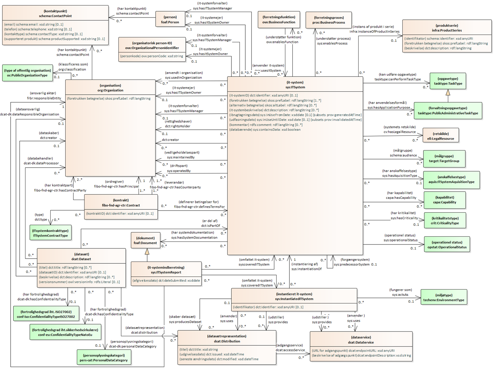

<style>
@media print {
  html { margin: 0cm 2cm 2cm 0cm; font-size: 80%; }
  /* DIGST fonts */
  body { font-family: "Helvetica Neue", Helvetica, Arial, sans-serif;}
  h2,h3,h4, h4 dfn { font-family: "Garamond", serif; color: black; margin-bottom: 0; font-style: normal; font-weight: normal;}
  h2:not(#subtitle) { page-break-before: always; font-size: 250%; border-bottom: solid 0.5px black; padding-top: 20px; margin-bottom: 6px;}
  h3 { font-size: 145%;}
  h4 { font-size: 125%;}
  #toc {page-break-before: always;}
  /* DIGST-like frontpage */
  .head { width: 50%; margin-left: 24px; padding: 0px; background-color: #031D5C;}
  .head div { background-color: white; padding: 24px; }
  .head hr { display: none;}
  .head h1 { background-color: #031D5C; color: white; margin: 0px; padding: 50px 0px 50px 24px; font-weight: normal; }
  #subtitle { padding-left: 24px; background-color: #031D5C; color: #031D5C; }
  .head time { display: block; font-family: "Helvetica Neue", Helvetica, Arial; margin: 0px; background-color: #031D5C; font-size: 80%; color: white;}
  .toc li { line-height: 70%; font-family: "Helvetica Neue", Helvetica, Arial;
    font-weight: 600; font-size: 90%; }
  h2.heading.settled > a.self-link, h3.heading.settled > a.self-link, h4.heading.settled > a.self-link, h4.heading.settled > a.self-link, h5.heading.settled > a.self-link, h6.heading.settled > a.self-link { display: none; }
  blockquote { font-size: 80%; font-style: italic; margin-left: 5%; width: 70%; border-left-width: 2px;}
	h2#abstract {display: none;}
	.p-summary {width: 50%; margin-left: 24px; padding: 0px;}
}
.new {
    border: solid 3px green;
    padding: 6px;
    margin: 18px 0px 18px 0px;
}

h2.heading.settled > a.self-link, h3.heading.settled > a.self-link, h4.heading.settled > a.self-link, h4.heading.settled > a.self-link, h5.heading.settled > a.self-link, h6.heading.settled > a.self-link { display: none; }

.term-table{
  font-size: 80%;
}

.term-table tr td:nth-of-type(3), .term-table tr td:nth-of-type(4), .term-table tr td:nth-of-type(5){
  word-wrap: anywhere;
  overflow-wrap: anywhere;
  hyphens: auto;
  word-break: break-all;
}

.term-table td{
  border-bottom: 1px solid #ccc;
  padding: 12px 8px;
}

.term-table tr td:first-child{
  font-weight: 600;
  word-wrap: break-word;
}

.term-table tr th:first-child{
  width: 20%;
}

.term-table tr th:nth-of-type(2){
  width: 22%;
}

.term-table tr th:nth-of-type(3){
  width: 15%;
}

.term-table tr th:nth-of-type(4){
  width: 15%;
}

.term-table tr th:nth-of-type(5){
  width: 15%;
}

.term-table tr th:nth-of-type(6){
  width: 13%;
}

.term-table tr td:nth-of-type(2){
  font-style: italic;
}

.term-table th{
  color: #fff;
  border: none;
  background-color: #940027;
  text-transform: capitalize;
  font-weight: 600;
  padding: 6px 8px;
}

.body{
  max-width: 100% !important;
}

.body.h-entry{
  max-width: 100%;
}

	@media screen and (min-width: 78em) {

		body.h-entry:not(.toc-inline) {
			padding-left: 25em;
		}
}
	
	
/* style til egne og andres definitioner rød/blå*/
</style>

<pre class="metadata">
Title: Standard for beskrivelse af it-systemer - Basisprofil
Status: LS
URL: https://github.com/digst/IT-System-AP/tree/master/SYS-AP
Editor: Digitaliseringsstyrelsen,, arkitektur@digst.dk
Editor: Rigsarkivet
Editor: KL
Editor: Danske Regioner
Editor: Organisationen Danske Arkiver
Editor: OS2KITOS
Abstract: Dette dokument 'Standard for beskrivelse af it-systemer - Basisprofil (archvSYS-AP)' udgør en fællesoffentlig standard for beskrivelse af offentlige myndigheders it-systemer.
Boilerplate: copyright no, conformance no, abstract no
Shortname: SYS-AP
Revision: 1.0.0
Date: 2019-02-25
Max ToC Depth: 3
Markup Shorthands: markdown yes
Repository: digst/IT-System-AP/tree/master/SYS-AP
Inline Github Issues: full
Logo: digst...
</pre>


<h1>Standard for beskrivelse af it-systemer - Basisprofil</h1>
<i>
Version 1.0.0 (Godkendt af Styregruppen for Data og Arkitektur i December 2019)</i>
                                            

**Læsevejledning:**

Dette dokument udgør en fællesoffentlig standard for beskrivelse af offentlige myndigheders it-systemer.

Kapitel 1 introducerer standardens formål, baggrund og den metode, hvormed standarden er blevet udarbejdet. Kapitel 2 og 3 beskriver standardens anvendelse ud fra forskellige indfaldsvinkler og skitserer udfordringerne ved at etablere et fælles sprog på området.

Kapitel 4 definerer standardens helt centrale begreb, *it-system*, og Kapitel 5 præsenterer indledningsvist en oversigt over standardens  underliggende emneområder, og hver sektion i dette kapitel dykker ned i et af emneområderne. I Kapitel 4 og 5 vil udvalgte begreber være markeret med **fed skrifttype** -- disse modelleres i den underliggende datamodel som klasser eller egenskaber og kan også ses i fx regnearksskabelon (Bilag B), maskinlæsbart format (Bilag C) og UML-modeller (Bilag E og F).

Kapitel 6 beskriver kort selve datamodellen. For en dybere gennemgang henvises til det selvstændige dokument 'Anvendelsesprofil for beskrivelse af it-systemer', som er selve datastandarden bag dette dokument målrettet dataarkitekter. Dette kapitel fortæller også, hvordan beskrivelser af it-systemer udarbejdet i henhold til standarden kan udveksles -- dels via regneark -- dels via et maskinfortolkeligt format.  Kapitel 7 indeholder en liste over eksisterende modellering på området og introducerer en overordnet mapning fra de eksisterende modeller til denne standard.

Kapitel 8 beskriver øvrige perspektiver ved anvendelsen af standarden, herunder potentialet ved sammenhængende modellering af data på tværs.

Bilagene kan inddeles i tre kategorier. Bilag A viser de klassifikationer/kontrollerede udfaldsrum, der anvendes i standarden, Bilag B og C giver skabeloner og vejledning til udfyldelse af oplysninger om it-systemer, og Bilag D-G omhandler den bagvedliggende begrebs- og datamodel.

Introduktion
================

Dette dokument udgør en fællesoffentlig standard for beskrivelse af offentlige myndigheders it-systemer. Standarden omfatter basisoplysninger om it-systemer, som fx it-systemnavn, it-systemejer, anvendelsesformål, ibrugtagningsdato mv., samt en ensartet struktur for disse oplysninger i et fælles udvekslingsformat, som gør det muligt at dele oplysninger om it-systemer på en effektiv måde. 

Formål
----------

Der indsamles oplysninger om offentlige it-systemer mange steder og på mange forskelligartede måder. Derfor er der god værdi i at standardisere den måde, it-systemer beskrives på, og dermed understøtte højere grad af genbrugelighed og kvalitet i de indsamlede oplysninger. Standarden forventes at have bred anvendelighed hos offentlige organisationer i en lang række forskellige udvekslingssituationer. En fælles standard har endvidere til formål at bidrage til at skabe et fælles og tværgående sprog for overblik over anvendte it-systemer.

Baggrund
------------

Standarden er etableret og efter aftale med KL, Danske Regioner og Digitaliseringsstyrelsen som følge af relateret standardiseringsarbejde udført efter anbefaling af Kulturministeriets Arkivudvalg. Standarden skal understøtte at it-systemer kan beskrives på en ensartet måde, og at beskrivelsen kan dække de mest udbredte behov for udveksling af information om it-systemer i det offentlige. Første konkrete ibrugtagning af standarden vil være i forbindelse afgivelse af oplysninger om it-systemer til Rigsarkivet. 

Metode
----------

Denne standard udgøres af en basisprofil (SYS-AP), som indeholder de basisoplysninger om it-systemer, der indgår i langt de fleste it-systembeskrivelser.  Basisoplysningerne udgør en fælles kerne, der kan udvides med yderligere kontekstafhængige oplysninger, i nye og mere specifikke anvendelsesprofiler. Informationer dannet på baggrund af to eller flere specifikke anvendelsesprofiler kan potentielt bringes til at hænge sammen via denne fælles kerne.

Den første anvendelsesprofil, som udvider basisprofilen, vil være målrettet arkivering (archvSYS-AP). Se også [Standard for beskrivelse af it-systemer - Arkivprofil](https://digst.github.io/IT-System-AP/archvSYS-AP/docs/)

<p align="center"></p>

Selve udviklingsarbejdet er foretaget i henhold de Fællesoffentlige regler for begrebs- og datamodellering, og standarden udgøres af en basisprofil, der sammensætter flere eksisterende nationale og internationale modeller.

Denne profil anvender fx kernemodeller til beskrivelse af it-system ([SYS](http://data.gov.dk/model/core/itsystem.html)), datasæt ([DCAT](https://www.w3.org/TR/vocab-dcat-2/)), organisation ([ORG](https://www.w3.org/TR/vocab-org/)), juridiske ressourcer ([ELI](https://op.europa.eu/en/web/eu-vocabularies/eli)), kontakter ([FIBO](https://spec.edmcouncil.org/fibo/)), klassifikationer ([SKOS](https://www.w3.org/TR/skos-primer/)) m.fl. Se Dataspecifikationsdokumentet for yderligere oplysninger om disse modeller. Flere af de internationale kernemodeller er profileret i forhold til en dansk anvendelseskontekst. Her kan nævnes dataspecifikationerne [Anvendelsesprofil for organisation](https://arkitektur.digst.dk/rammearkitektur/datastandarder/anvendelsesprofil-organisationer), [Anvendelsesprofil for klassifikation,](https://arkitektur.digst.dk/rammearkitektur/datastandarder/anvendelsesprofil-klassifikationer) samt Anvendelsesprofil for et Fællesoffentligt Datasætkatalog. Flere af disse anvendelsesprofiler er mappet til OIO-standarderne.

Basisprofilen og arkivprofilen er blevet udarbejdet på baggrund af research- og udviklingsaktiviteter kombineret med feedback fra og sparring med en projektgruppe med medlemmer fra følgende interessentorganisationer: Rigsarkivet, KL, Danske Regioner, Organisationen Danske Arkiver, OS2Kitos og Digitaliseringsstyrelsen med repræsentanter fra Ministeriernes Kontor for it-styring og Center for Teknologi og Datastrategi. I forbindelse med researchaktiviteterne er flere eksisterede modeller og værktøjsunderstøttelse til registrering af it-systemer undersøgt nærmere, fx Model for porteføljestyring af statslige it-systemer, OS2Kitos og Rigsarkivets anmeldelses- og tilsynsskemaer. Læs mere om dette i Mapning til eksisterende modeller.


Standardens anvendelse og afgrænsning
=========================================

Basisprofilen danner grundlag for fællesoffentlig deling af oplysninger om it-systemer via emne- eller områdespecifikke anvendelsesprofiler. De specifikke profiler etableres med udgangspunkt i basisprofilen og efter behov.


Afgrænsning
---------------

It-systemer kan beskrives ud fra flere forskellige aspekter eller emner. Basisprofilen indeholder oplysningstyper for en række aspekter af it-systemer. Med basisprofilen er det forsøgt at finde en passende balance mellem et indhold, der ikke bliver for omfattende, og et indhold, der berører organisatorisk væsentlige emner, og områder, der kan beskrives i mere specifikke profiler. Basisprofilen er altså ikke tænkt som en altfavnende beskrivelse af alle aspekter omkring it-systemer. Profilens model skal alene give en *overordnet* indgang til de it-systemer, en organisation anvender.

Uddybende beskrivelse af emner som eksempelvis kontraktstyring, infrastruktur og sikkerhed vil kræve andre modeller, udtrykt i andre mere specifikke anvendelsesprofiler. Basisprofilens model er skabt med fokus på at kunne lette integrationen mellem øvrige it-systembeskrivende modeller og profiler.

<p class="note">Eksempelvis bidrager standarden med overordnede oplysninger om it-systemers tekniske indretning (jf afsnittet om teknisk indretning i Kapitel 4), men giver ikke i sig selv mulighed for at udtrykke detaljerede oplysninger om fx hardwareinstanser eller lignende.</p>

Anvendelse
--------------

Når der fremover defineres anvendelsesprofiler, hvor *it-system* er det centrale emne, skal basisprofilen bruges som afsæt for den nye profil. I den nye profil skal basisprofilens elementer indgå i så stort et omfang som muligt for at give det bedst mulige grundlag for efterfølgende at skabe sammenhæng mellem datasæt etableret på baggrund af ellers forskelligartede it-system-profiler.

Basisprofilens elementer består af klasser, egenskaber (attributter), der beskriver den enkelte klasse, samt egenskaber (associationer), der beskriver relationer mellem klasser. Disse elementer enten kan eller skal genanvendes af de mere specifikke anvendelsesprofiler, der dannes på baggrund af basisprofilen. Angivelsen af, om og hvordan det enkelte element indgår i en ny anvendelsesprofil, angives forskelligt for klasser og for egenskaber.

### Anvendelse af klasser

For hver enkelt klasse, der er del af basisprofilen, angives det om klassen enten skal, bør eller kan indgå i en ny profil.

Klasser, der altid skal indgå i applikationsprofiler baseret på basisprofilen, markeres med en stereotypeangivelse kaldet *mandatory* (obligatorisk).

Klasser, der anbefales at indgå for at sikre det bredest mulige grundlag for sammenhæng mellem de enkelte profiler, er markeret med stereotypen *recommended* (anbefalet). Disse klasser bør i videst muligt omfang medtages, hvis der er datagrundlag for det i de datasæt de nye profiler rettes mod.

Klasser, der kan indgå, men ikke nødvendigvis skal indgå, markeres som *optional* (valgfri).

### Anvendelse af egenskaber

Basisprofilens egenskaber anvender ikke angivelserne *mandatory*, *recommended* og *optional*. For alle egenskaber, attributter og associationer angives i stedet egenskabens multiplicitet. Det vil sige; det angives, hvor mange der mindst skal være, og hvor mange der højest må være af en attribut eller en association.

I basisprofilen er de fleste multipliciteter holdt relativt åben ved at angive mindsteværdien som *0* (nul) og maksimumværdien som * (ubegrænset). Nye profiler baseret på basisprofilen kan altid indsnævre en multiplicitets udfaldsrum yderligere, men må ikke udvide den!

Der er indført visse grundlæggende krav til beskrivelse af it-systemer i basisprofilen i form af multipliciteter. Der *skal* udfyldes **it-systemnavn** og **it-systembeskrivelse**,. Disse krav er baseret på en vurdering af laveste fællesnævner for fremtidige profileringer. Øvrige oplysninger *kan* udfyldes. Se disse udfyldelseskrav i Bilag B eller se multipliciteterne i UML-diagrammerne,

### Ny anvendelsesprofil med udgangspunkt i basisprofilen

Princippet for oprettelse af nye profiler på baggrund af basisprofilen vises her i form af et eksempel, hvor anvendelsesprofilen for arkivering bruges som eksempel på en ny profil.

Med udgangspunkt i den eksisterende basisprofil vurderes anvendeligheden af de enkelte klasser og egenskaber ud fra de behov, der kendes til en arkiveringsprofil.

Når vurderingen er foretaget, har man en reduceret profil som illustreret på nedenstående diagram. Alle elementer markeret med grønt vil indgå i den nye arkivprofil, mens alle elementer markeret med rød ikke inddrages i profilen.

<p align="center"><a href="img/Figur_application_profile1.jpg"></a></p>

Derefter tilføjes de elementer der er nødvendige for arkivprofilen og der sættes eventuelle yderligere begrænsninger på multipliciteter. I nedenstående diagram er tilføjelser og multiplicitetsændringer markeret med orange.

<p align="center"><a href="img/Figur_application_profile2.jpg"></a></p>

Standardisering af deling af it-systemoplysninger
-----------------------------------------------------

Basisprofilen danner grundlag for entydige og præcise udvekslinger af it-systemoplysninger til en lang række formål. Oplysninger om offentlige it-systemer indsamles mange steder, men på forskellig vis. Med et fælles sprog, som profilen præsenterer, lægges fundamentet for en ensartet og konsistent udveksling af data om it-systemer. Brug af profilen vil ikke betyde, at eksisterende modeller eller interne registreringer skal laves om, men gør at de kan mappes til et fælles sprog, så data kan deles på en effektiv og entydig måde via et maskinlæsbart format uden behov for manuel behandling, eksempelvis for at opfylde informationsbehovet i forbindelse med afgivelse af systemoplysninger til hjemmelshavende myndigheder.

<p class="note">
Eksempelvis kan anvendelse af basisprofilen danne udgangspunkt for maskinlæsbar afgivelse af systemoplysninger til myndigheders interne it-systemoverblik og det statslige it-systemporteføljeoverblik jf. [Strategi for it-styring i staten](https://digst.dk/strategier/strategi-for-it-styring-i-staten/), da kerneinformationerne vil være omfattet af standarden allerede. Dette kunne gøres i form af en udvidelse i form af en mere specifik anvendelsesprofil til håndtering af de vurderingsspørgsmål, fx "I hvilken grad er der omskiftelighed i forretningsgrundlaget for it-systemet?". Der kan også arbejdes videre med disse systemoplysninger i forbindelse med udarbejdelse af fortegnelse over databehandlingsaktiviteter, jf. [Datatilsynets Vejledning om fortegnelse](https://www.datatilsynet.dk/media/6567/fortegnelse.pdf).</p>

It-systemoversigt og Datamanagement
---------------------------------------

Standarden kan danne grundlag for, at en myndighed internt vedligeholder data omkring myndighedens it-systemer ét sted, samt eventuelt at lade disse sammenstilles med oplysninger fra andre relevante datakilder. Via sammenhængene modellering kan der udtrækkes forskellige datasæt til opfyldelse af forskellige indmeldingsforpligtelser og --krav. Ikke alle oplysningstyper vil være relevante til alle anvendelser, hvorfor yderligere profileringer og udvælgelse af relevante oplysningstyper kan være nødvendige til øvrige anvendelser.

Med en standardiseret model og format vil myndigheder også kunne dele informationer på tværs på frivillig basis. Denne deling kan eksempelvis ske i form af et fælles it-systemregister, hvor myndigheder kan finde informationer om it-systemer samt svar på en række spørgsmål som:


- *Hvilke andre myndigheder anvender system X?*
- *Hvor mange it-systemer har borgere som målgruppe?*
- *Hvilke it-systemer understøtter myndighedernes interne it-udvikling (FORM-opgave)?*
- *Hvilke databærende it-systemer skaber og eventuelt udstiller datasæt, der skal registreres i et fællesoffentligt datasætkatalog?*
- *Hvilke system-til-system-integrationer findes der, og kan de kritiske\
afhængigheder identificeres?*
- *Hvilke it-systemer indeholder fortrolige eller personfølsomme data?*


Udfordringer
================

Etableringen af et fælles sprog kan danne grundlag for effektiv udveksling af data om it-systemer, men standardisering har også nogle iboende udfordringer og kræver et overblik over eksisterende begreber og indfaldsvinkler

Forskellige indfaldsvinkler
-------------------------------

Der indsamles oplysninger om offentlige it-systemer mange forskellige steder, men formålet og fokus kan variere meget, alt afhængig af om indfaldsvinklen er arkivering, forretnings- og samfundskritikalitet, drift og IT-service-management, kontraktstyring eller arkitekturbeskrivelse.

I forhold til basisoplysninger, som indgår i de eksisterende modeller, kan der fx være mange lighedspunkter og identiske begreber, men flere er ikke defineret på helt samme måde, og selvom termerne ofte er enslydende, er der også stor variation. Terminologien og begreberne, som de findes i de forskellige modeller, afspejler typisk indfaldsvinklen og den formelle ramme, som har dannet grundlag for modellen, og det formål, modellen er udarbejdet med. Læs mere om dette i Kapitel 7 om mapning til eksisterende modeller.

Hver specifik anvendelse kræver klar formålsbeskrivelse
-----------------------------------------------------------

Det vil være nødvendigt i forbindelse med hver specifik anvendelse at undersøge, hvilket formål profileringen af standarden skal løfte, samt hvilken delmængde af en potentielt meget stor mængde af mulige it-systemer der ønskes beskrevet.

Formål, detaljeringsgrad eller granularitet og relevante klassifikationer skal vurderes nøje, så relevante oplysninger om relevante it-systemer kan registreres, og så det er muligt at danne et overblik over it-systemer, der opfylder givne kriterier.

Centrale begreber
=====================

Begrebet *it-system* udgør det centrale element i denne standard og defineres bredt for at kunne favne mange anvendelser. Ved at koble dette til relevante klassifikationer bliver det muligt med standarden at indsnævre mængden af de it-systemer, der skal beskrives.


System, informationssystem, it-system og implementering
-----------------------------------------------------------

Et **system** defineres generelt som "*et system er en kombination af interagerende elementer, der er organiseret for at opnå et eller flere erklærende formål"* ligesom i[ISO/IEC 15288](https://www.iso.org/standard/63711.html).
Det bemærkes også, at *"Et system er i denne sammenhæng menneskeskabt og består ikke blot af hardware, software og data, men også af mennesker, processer, procedurer, faciliteter og materialer og naturlige genstande".*

Ser vi alene på systemer til indsamling, organisering, lagring og kommunikation af information, har vi at gøre med informationssystemer, og når (computer)-teknologi anvendes til at behandle disse informationer eller data, har vi at gøre med it-systemer[[5]].

<p class="note">
Begrebet *it-system* er altså en specialisering af *system* fra [ISO 15288](https://www.iso.org/standard/63711.html), idet der fokuseres på IT-aspektet. Det vurderes derudover at definitionen er tråd med ISO/IEC TR 10000-1:1998(en) Information technology --- Framework and taxonomy of International Standardized Profiles og ISO/IEC TR 12182:2015 (Systems and software engineering -- -- Framework for categorization of IT systems and software, and guide for applying it.
</p>	

Begrebet **it-system** defineres derfor i denne standard som *system, der består af digitale informationsteknologier.*  

Definitionen er bevist holdt meget bredt favnende for at kunne dække de mange definitioner på it-system, som standardarbejdet har mødt i offentligt regi. Eksempelvis defineres it-system i 'Model for porteføljestyring af statslige it-systemer' med teksten:

*et produkt eller en ressource, der understøtter en eller flere forretningsprocesser og omfatter såvel applikationen som den nødvendige hardware og it-infrastruktur til brug for it-systemets afvikling af statslige it-systemer omfatter også it-systemer, hvor myndigheden har it-systemejerskabet, men hvor it-systemets drift forestås af en ekstern part, for eksempel Statens It eller en privat leverandør.*

Nærværende standards brede definition på et it-system inkluderer altså den mere specifikke, der anvendes af porteføljestyringsmodellen.

Det er også vigtigt at bemærke, at et givet it-system kan instantieres i forskellige it-miljøer. Et **instantieret it-system** kan derfor defineres som "*fysisk instans af et it-system i et bestemt it-miljø".* Fxet testmiljø eller et produktionsmiljø.

### Forskellige formål med beskrivelsen

Denne standard forventes at få bred anvendelse hos offentlige myndigheder til flere forskellige formål, hvorfor definitionen af begrebet *it-system* har en så anvendelsesneutral og generel karakter som muligt inden for standardens rammer. Det betyder også, at definitionen som udgangspunkt favner mange flere instanser af it-systemer, end hvad et bestemt indmeldingsformål måtte have brug for. Derfor anvendes en række klassifikationer, som giver mulighed for at netop at udpege den delmængde af it-systemer, det er relevant at undersøge eller beskrive til et givet formål.

### Klassifikationer

Klassifikationerne vil blive introduceret og defineret under de relevante emneområder i det følgende kapitel.[[6]]

Fælles for de nyetablerede klassifikationer er, at de alle er modelleret som selvstændige modeller iht. den internationale W3C-specifikation SKOS ([Simple Knowledge Organization System](https://www.w3.org/TR/skos-primer/)). Der er også udarbejdet en [dansk profil](https://arkitektur.digst.dk/rammearkitektur/datastandarder/anvendelsesprofil-klassifikationer) på baggrund af denne som også er mappet til OIO Klassifikation.

<p class="note">
Klassifikationer beskrives iht. anvendelsesprofil for klassifikation: [https://arkitektur.digst.dk/rammearkitektur/datastandarder/anvendelsesprofil-klassifikationer](https://arkitektur.digst.dk/rammearkitektur/datastandarder/anvendelsesprofil-klassifikationer)
</p>

Det forventes, at de relevante myndigheder forretningsgodkender og overtager ansvaret for indholdet af de respektive klassifikationer.

### Hvornår er der tale om et nyt it-system?

I forhold til ibrugtagningen af et it-system i en organisation kan det i visse tilfælde være svært at vurdere, hvornår der er tale om, at organisationen overgår fra ét it-system til et andet, eksempelvis ved overgangen fra én version af et kommercielt produkt til en anden version. Her kan vurderingen tage udgangspunkt i, om it-systemet *leverer en anden service* end den oprindelige, hvilket ofte er forbundet med etableringen af en ny kontrakt med rettighedshaveren af det kommercielle produkt. Ny kontrakt vil altså ofte betyde nyt it-system, modsat løbende opdateringer og fejlrettelser til kørende it-systemer. I forhold til databærende systemer kan det også være relevant at se på, om fx hele den bagvedliggende databasestruktur er skiftet ud.

Som det blev beskrevet i foregående kapitel, kan man have behov for at beskrive it-systemer ud fra forskellige indfaldsvinkler, og denne indfaldsvinkel er også afgørende for hvad et it-systemoverblik skal indeholde. Tager man eksempelvis udgangspunkt i den overordnede it-service, som tilbydes slutbrugeren, kan det være tilstrækkeligt at se på it-systemet som et samlet hele, hvorimod det i forhold til drift, vedligehold og kritikalitet typisk er nødvendigt at beskrive it-systemets underliggende applikationskomponenter og afhængigheder, som tilsammen udgør it-systemet. 

Implementering og anvendelse; instantieret it-system
--------------------------------------------------------

Begrebet **it-system** udtrykker it-systemer i en organisation for -- som førnævnt -- at opnå et eller flere erklærede formål. Et konkret, implementeret eller *instantieret* it-system kaldes et **instantieret it-system**. Et instantieret it-system kan i basisprofilen beskrives som havende relationer til en eller flere fysiske datasæt og/eller en eller flere services.

I basisprofilen ligger fokus på de oplysninger, der typisk udveksles, hvorfor yderligere infrastrukturoplysninger om hardware og software ikke indgår her. Basisprofilen er opbygget, så den kan danne udgangspunkt for en infrastrukturprofil med disse oplysninger.

It-systemets produktserie
-----------------------------

Det kan være praktisk at kunne omtale systemer, der, i deres udviklingsforløb, har mange versioner under en fælles betegnelse, der dækker alle versioner af systemet.

Hvis vi eksempelvis har systemet 'SuperSystem X', der eksisterer som 'SuperSystem X, version 1' 'SuperSystem X, version 2' og 'SuperSystem X, version 3', vil de tre systemer (og deres efterfølgere) ofte blot blive regeret til som 'SuperSystem X' -- uden versionsangivelse.

For at dække dette behov anvender basisprofilen klassen **produktserie.**  

Standardens emnemæssige relationer
======================================


I det følgende gives en oversigt over standardens potentielle emnemæssige relationer og en beskrivelse af hvert underliggende emneområde

It-systemer kan beskrives ud fra flere forskellige aspekter eller emner. De helt grundlæggende kerneinformationer ses i midten af figuren herunder, og de øvrige otte emneområder afspejler grundperspektiverne fra rammearkitekturen: styring, strategi, jura, sikkerhed, opgaver, information, applikation og infrastruktur, som beskrives i [Hvidbog om fællesoffentlig digital arkitektur](https://arkitektur.digst.dk./mandat-og-styring/hvidbog-om-faellesoffentlig-digital-arkitektur) (FDA).

<p align="center"></p>
Figur 5.1: Illustration af standardens emnemæssige

Disse otte emner dækker bredt, og for at dække en specifik anvendelseskontekst vil det typisk være nødvendigt at udvide basisprofilen med oplysninger fra forskellige emneområder. I tillæg til de otte emneområder eksisterer et metalag med informationer om myndighedens udveksling af disse oplysninger til et bestemt formål, men dette præciseres nærmere i de konkrete anvendelsesprofiler.

Kerneinformation
--------------------

Et it-system kan forsynes med en **identifikator** (et ID) der entydigt udpeger det konkrete it-system. Et it-system tilføjes et eller flere navne. Et af navnene vil være it-systemets primære eller **foretrukne navn,** men andre, fx kaldenavne, kan angives som **alternative navne.**

Hvor et it-system kan beskrives som en implementering og ibrugtagning af et softwareprodukt tilhørende en bestemt produktserie, som fx Acadre eller F2, vil it-systemnavnet typisk være lig **navnet på produktserien,** som producenten har markedsført eller som anført i hovedkontrakten med leverandøren, men it-systemet kan også have andre lokale navne.

En produktserie kan have en overordnet **beskrivelse af produktseriens** egenskaber, som det fx ses i SKI-kataloget[[8]], men i forbindelse med ibrugtagning er det også muligt at angive en **it-systembeskrivelse,** som i fritekst redegør for formålet med it-systemets anvendelse eller it-systemets nøglefunktion i en organisation. Derudover bør et it-systems **anvendelsesformål** også beskrives ved opmærkning ift. offentlige opgaver med klassifikationerne FORM/KLE, som det beskrives under emnet 'forretningsunderstøttelse'. Supplerende bemærkninger eller oplysninger kan også tilføjes som en **kommentar** i fritekst.

Som en del af kerneinformationerne hører **ibrugtagningsdato** og **udfasningsdato,** som tilsammen beskriver perioden fra den dato, hvor it-systemet blev taget i brug med delvis eller fuld funktionalitet, indtil den dato, hvor it-systemet endeligt bliver afviklet. Datoangivelserne kan eventuelt suppleres med en **operationel status,** som angiver, hvilken tilstand systemet befinder sig i, i forhold til ibrugtagning. Se udfaldsrummet i Bilag A.

For at kunne identificere, hvilken version af softwareproduktet der er taget i anvendelse, eksempelvis i forhold til en bestemt kontrakt med en leverandør, kan det være relevant at angive et **versionsnummer**. Hvis et versionsnummer er specificeret i kontrakten, bør dette anvendes.

<p class="note">Eksempelvis kan der ved anvendelse af cBrains F2 angives version 5.3 (og ikke 5.3.0.41112)</p>

Opgaver
-----------

Et it-system yder en given it-service, som understøtter forretningens opgaver. Et it-system kan beskrives med et eller flere anvendelsesformål, der antages at være at understøtte en **forvaltningsopgave**. Til dette formål anvendes en klassifikation over offentlige opgaver eller såkaldte forvaltningsopgavetyper såsom Den Fællesoffentlige Referencemodel (FORM) eller KL Emnesystematik (KLE).  KLE er en emnesystematik/journalplan, der dækker det kommunale område. FORM er en overordnet emnesystematik, der dækker opgaveporteføljen i hele den offentlige sektor -- dvs. staten, kommunerne og regionerne. KLE er som regel mere detaljeret end FORM på det kommunale område. Det foreslås, at KLE anvendes af kommunerne, og FORM af regioner og statslige administrative enheder -- som minimum på det øverste niveau (hhv. serviceområde i FORM og emnegruppe i KLE):

**Klassifikation KLE:** [http://www.kle-online.dk/soegning](http://www.kle-online.dk/soegning)

**Klassifikation FORM:** [http://www.form-online.dk/soegning](http://www.form-online.dk/soegning)

<p class="note">Eksempelvis kan en myndighed anvende Formpipes Acadre og cBrains F2 ESDH til at understøtte FORM-forvaltningsopgaven "65.50.05.05 Sagshåndtering" (FORM v.2.14) el. KLE-emnet "00.15.12. Kvalitetsstyringssystem, sagsbehandling" (KLE v. Aug. 2019)</p>

<p class="note">
Bemærk, at produkter i [SKI-kataloget(https://skikataloget.ski.dk/ski-kataloget/) allerede er opmærket med FORM samt internationale referencekoder såsom Common Procurement Vocabulary Codes ([CPV](https://udbudsportalen.dk/cpv-koder/))  og United Nations Standard Product and Services Code ([UNSPSC](http://unspsc.gs1.dk/find-din-kode/)), som er klassifikationer for hhv. udbudte opgaver og varer og tjenesteydelser. Bemærk, at en sådan opmærkning angiver, at produktet har **kapabilitet til at understøtte** en given opgave. SKI anvender tillige [STORM](http://arkitekturguiden.digitaliser.dk/storm) på trods af, at den ikke længere opdateres. STORM er en taksonomi over it-servicestyper. På samme måde som FORM kategoriserer og beskriver det offentliges opgaver, blev STORM udviklet til at give en overordnet klassifikation og beskrivelse af de it-systemer, der bruges i den offentlige forvaltning. STORM vedligeholdes ikke pt. og det er projektgruppens vurdering at den ikke umiddelbart kan tages i anvendelse i denne standard. Flere interessenter har dog i forbindelse med standardens udarbejdelse udtrykt et behov for en sådan klassifikation ifm. øvrige anvendelser. Dette bør analyseres nærmere.
</p">

FORM og KLE indeholder henvisninger til de love og lovbekendtgørelser, som de offentlige opgaver udspringer fra, så ved at opmærke et it-system med FORM eksisterer der også indirekte en relation til retsgrundlaget for it-systemets anvendelse. Der er også muligt via FORM at se, hvilke myndigheder de forskellige opgaver tilhører. KLE indeholder, ud over love og lovbekendtgørelser, også bekendtgørelser. FORM mapper til paragraffer i finansloven og KLE, og KLE mapper til Social- og Indenrigsministeriets kontoplan.

Et it-system kan opmærkes i forhold til de **forretningsfunktioner** som it-systemet understøtter. En forretningsfunktion er en funktion, der kan udføres eller varetages af organisationsenhederne i organisationen. Når en organisation skifter et it-system ud med et andet it-system til varetagelse af samme funktion, kan det tidligere it-system angives som et såkaldt **forgængersystem.**

Bemærk, at en organisations portefølje af it-systemer kan være sammensat af dels organisationens internt-rettede it-systemer (fx et sagsbehandlingssystem til organisationens egne medarbejdere) og dets eksternt-rettede it-systemer (fx et borgerrettet selvbetjeningssystem). Med henblik på at kunne skelne mellem it-systemer med en snæver målgruppe og it-systemer med en bred målgruppe kan it-systemer klassificeres ift. en **målgruppeklassifikation**, se Bilag A. Her angives, om it-systemet har en intern eller ekstern målgruppe set ift. organisationen.

Styring
-----------

Et it-system kan have mange forskellige relationer til aktører, som hver især har en særlig interesse i systemet, og som dermed udgør systemets interessenter. Aktører kan være organisationer, organisatoriske personer eller fysiske personer men det anbefales, i det omfang det er muligt, ikke at registrere oplysninger om personer, men derimod den relevante medarbejderrolle eller organisatoriske enhed.

<p class="note">
Med et **organisatorisk person-ID** kan en persons tilhørsforhold og medlemskab i organisatoriske enheder udtrykkes. Et organisatorisk person-ID er en persons identitet i organisationsenheder og er eksempelvis udtrykt igennem personens initialer, som er unikke inden for organisationsenheden. En person kan have tilhørsforhold til flere organisationer og kan dermed kan flere organisatorisk person-ID'er tilknyttet.
</p>

På overordnet niveau angives **it-systemejeren** -- en person eller organisation med det overordnede ansvar for et givet it-systems drift, vedligehold og anvendelse. Ofte vil it-systemejeren være lig kontraktejeren og kan identificeres præcist i myndighedens kontraktstyring.

I en given organisations praktiske og tekniske forvaltning af et it-system er det også vigtigt at registrere **it-systemforvalteren**, dvs. den organisatoriske enhed eller person, som administrerer og træffer afgørelser vedrørende tekniske anliggender **på vegne af** systemejeren. I forbindelse med større it-systemer kan forvalterrollen være opdelt i en intern forretningsmæssig forvalterrolle og en teknisk forvalterrolle hos en leverandør.

<p class="note">Eksempelvis er Kontorchefen for Center for Systemforvaltning i Digitaliseringsstyrelsen it-systemejer for NemLog-in, mens it-systemet forvaltes af NemLog-in-teamet.</p>

For databærende it-systemer skal den **dataansvarlige** aktør også angives, dvs. den organisation som har det administrative ansvar for data. I forhold til persondata indsnævres denne definition yderligere til "*en fysisk eller juridisk person, en offentlig myndighed, en institution eller et andet organ, der alene eller sammen med andre afgør, til hvilke formål og med hvilke hjælpemidler der må foretages behandling af personoplysninger*", jf. [GDPR](http://data.europa.eu/eli/reg/2016/679/oj). Én myndighed kan være dataansvarlig for et system, mens det faktisk er **databehandler,** som behandler personoplysninger på den dataansvarliges vegne, der er i besiddelse af systemet og anvender det.  Det kan være en fordel at registrere begge oplysninger. I nogle tilfælde er der forskel på dataansvarlig og databehandler. I det omfang, at leverandører har fået instruks af den dataansvarlige til at behandle personoplysninger, betragtes disse også som databehandlere, jf. [Datatilsynets vejledning om databehandlere og dataansvarlige](https://www.datatilsynet.dk/media/6560/dataansvarlige-og-databehandlere.pdf). Det kan også være relevant at angive den konkrete **dataskaber**, dvs. den aktør, der har det primære ansvar for tilvejebringelsen af datasættet.

Et it-system kan dokumenteres ved hjælp af forskellige dokumenter, der hver har sit formål og målgruppe, fx via **dokumentationsreference** såsom arkitekturdokumentation, installationsvejledning og slutbrugervejledning.

Strategi
------------

Det strategiske perspektiv omhandler ønskede fremtidige tilstande for myndighedernes it-systemer. Ledelsen i offentlige myndigheder skal være skarpe på de it-systemer, de råder over, og hvordan it-systemerne bedst understøtter myndighedernes arbejde aktuelt og i fremtiden. Det giver bedre mulighed for løbende at gennemføre strategiske forbedringer, der fx kan være vigtige for datakvalitet, brugervenlighed og sikkerhed.

Et it-system kan således indgå i en overordnet kortlægning med henblik på udarbejdelse af **tilknyttede handlingsplaner**. Denne oplysninger indgår ikke i basisprofilen, men ville være relevant at definere og medtage i en portefølgestyringsprofil.

Jura
--------

I forbindelse med ibrugtagning og anvendelse af et it-system kommer der typisk en lang række leverandørkontrakter i spil, men i denne standard fokuseres på leverandører, der leverer en ydelse ift. udvikling, vedligehold, drift og support af it-systemet. Disse oplysninger vil typisk være indsamlet og registreret i forbindelse med kontraktstyring.

Derudover vil det i denne standard også være muligt helt overordnet at angive it-systemets primære **udviklingspart**, **vedligeholdelsespart** og **driftspart**. 

Bemærk dog, at denne direkte angivelse af it-systemets primære leverandører skal betragtes som en forenkling, som typisk ville kunne udledes via kontraktens parter.

Bemærk også, at selvom interne -- både mundtlige og skriftlige -- aftaler vedrørende et mindre egenudviklet it-systems videreudvikling, vedligehold og drift ikke altid er beskrevet i formelle og juridisk bindende kontrakter, kan disse stadig betragtes som værende kontrakter, og beskrives som sådan. 

Allerede inden en givet produktserie tages i anvendelse, har produktserien typisk allerede en række relationer, som fx er registreret i OS2Kitos. De intellektuelle rettigheder til produkter i en produktserien besiddes af en **rettighedshaver**, og myndighedens brugsret i forhold til it-systemets og dets komponenter kan variere i forhold til it-systemets type og aftalte kontraktforhold.

Et it-system kan være relateret til en lang række kontrakter, hvoraf der i denne standard fokuseres på de kontrakter, der vedrører it-systemets udvikling, vedligehold, drift og support. Som beskrevet ovenfor er det muligt blot at angive en overordnet relation fra et it-system til hhv. udviklingspart, vedligeholdelsespart el. driftspart, men en mere præcis beskrivelse af leverandørforhold kan opnås ved at beskrive sammenhængen til de formelle it-kontrakter.

Til beskrivelse af kontrakter anvendes et vokabular for finansielle forretninger, herunder [kontrakter](https://spec.edmcouncil.org/fibo/FND/Agreements/Contracts), Financial Industry Business Ontology [FIBO](https://www.omg.org/hot-topics/finance.htm), som er et fælles produkt fra OMG og Enterprise Data Management (EDM) Council.

For et it-system kan der angives referencer til kontrakternes **identifikation** i et kontraktstyringssystem, eventuelt suppleret med en kontrakttypeopmærkning ved hjælp af en **it-kontrakttypeklassifikation**, se Bilag A.

Én kontrakt med en given leverandør kan også indeholde aftale om flere ydelser på én gang, fx en kombineret drifts- og vedligeholdelsesaftale. Softwarelicenskontrakter betragtes som værende af en særlig karakter. Anskaffelse af standardsoftware kræver typisk også, at de indkøbte licenser administreres, og at licensvilkår overholdes. Derfor kan det internt i en organisation kan være relevant at registrere mere detaljerede oplysninger om licenser. Derudover kan der efter behov tilføjes yderligere oplysninger vedrørende kontrakten såsom **kontraktparter** og **kontraktperioder,** som kan være særligt relevante ift. systemet forvaltning og vurdering af kontrakters udløbsdatoer etc. Disse masterdata vil dog typisk være at finde i et kontraktstyringssystem.

Information
---------------

De data, som et instantieret it-system **skaber,** kan betragtes som en specifik fysisk **repræsentation** af et **datasæt** -- en samling af oplysninger bestående af enkelte dele der forvaltes under ét [(Referencearkitektur for deling af data og dokumenter](https://arkitektur.digst.dk/sites/default/files/20180503_rad_v1.0_-_godkendt_af_sda.pdf)), og beskrivelsen af datasæt og datasætrepræsentationer følger i denne sammenhæng W3Cs Data Catalogue Vocabulary ([DCAT](https://www.w3.org/TR/vocab-dcat/)). Et datasæt og dets repræsentationer kan forsynes med en **titel,** og **første og sidste datatilføjelsesdato** kan angives for datasætrepræsentationen.  

Datasætrepræsentationer, som it-systemet **udstiller*** og **anvender,** bør registreres ved reference til [Datasætkataloget](https://arkitektur.digst.dk/det-faellesoffentlige-datasaetkatalog). Det fællesoffentlige datasætkatalog er et katalog, der har til hensigt at samle metadata om myndigheders datasæt, hvilket blandt andet understøtter Lov om videreanvendelse af den offentlige sektors informationer ([PSI-direktivet](https://www.retsinformation.dk/eli/lta/2005/596)).

Sikkerhed
-------------

Emnet sikkerhed kan vedrøre mange forskellige aspekter, fx informationssikkerhed, persondatasikkerhed, forretnings- og samfundskritikalitet og fortrolighed.

I henhold til [GDPR](http://data.europa.eu/eli/reg/2016/679/oj) og Datatilsynets [Vejledning om fortegnelse](https://www.retsinformation.dk/eli/lta/2018/502) er det for databærende it-systemer relevant at være opmærksom på **datasletningsfristen**, dvs. førstkommende dato for, hvornår bestemte data i systemet skal være slettet forinden.

It-systemet kan opmærkes med en **personoplysningskategori**, som er beskrevet i Datadatatilsynets vejledning, og på denne måde oplyses det, hvorvidt systemet indeholder følsomme personoplysninger eller almindelige personoplysninger, herunder personnummeroplysninger og oplysninger om strafbare forhold. Dertil tilføjes en angivelse af fraværet af personoplysninger, se Bilag A. De følsomme oplysninger er udtømmende oplistet i databeskyttelsesforordningen, og alle andre oplysninger er derfor almindelige personoplysninger. Oplysninger om strafbare forhold og personnumre betragtes som almindelige personoplysninger, men databeskyttelsesloven fastsætter særlige regler om disse oplysninger. Som en hjælp til præcisering kunne en klassifikation med personoplysnings*underkategorier* eventuelt opstilles.

It-systemer skal kunne opmærkes ift. deres grad af kritikalitet ved hjælp af klassifikation for **kritikalitetstyper**. Se bilag A. Myndigheden kan vælge at tage udgangspunkt i følgende definitioner af hhv. et samfundskritisk og et forretningskritisk it-system. Et **samfundskritisk it-system** er et it-system, som enten er vigtigt for den nationale sikkerhed eller for vigtig infrastruktur, hvor misbrug af data vil have store konsekvenser, eller hvor driftsforstyrrelser kan have stor betydning for økonomien i staten eller for mange borgere eller virksomheder. **Et forretningskritisk it-system** er et it-system, hvor driftsforstyrrelser kan medføre, at størstedelen af myndighedens medarbejdere ikke kan udføre deres arbejde, eller at myndigheden vanskeligt kan overholde sine forvaltningsmæssige forpligtelser.

Data i it-systemet kan klassificeres med flere forskellige klassifikationer ift. fortrolighed, fx **Fortrolighedsgrad** iht. [ISO27002](https://www.iso.org/standard/54533.html) eller **Fortrolighedsgrad** iht. [sikkerhedscirkulæret -EU/NATO](https://www.retsinformation.dk/eli/retsinfo/2014/10338). Se Bilag A. I forhold til klassifikation iht. sikkerhedscirkulæret kan tilføjes *uklassificeret*, så det kan angives, at der er taget stilling til fortrolighedsgraden.

<p class="note">Eksempelvis kan data i beredskabssystemer eventuelt være opmærket med fortrolighedsgrad, og fortrolighed kan være et relevant aspekt ved indmelding af it-systemoplysninger såsom kritikalitetstype og systemernes tekniske tilstand.</p>

Applikation
---------------

Det er muligt, som nævnt i Kapitel 4,  at udpege den **produktserie,** it-systemets primære softwareprodukt tilhører, og derudover kan **it-systemanskaffelsestypen** (se Bilag A) angives, dvs. om it-systemet er udviklet i egen organisation, er bestillingsudviklet (fx ved udbud) eller anskaffet som et kommercielt (Commercial-of-the-shelf, COTS) eller open source-standardsystem.

Kommercielle produkter vil for eksempel ofte være beskrevet med metadata af producenten, som også kan indgå i SKI-kataloget, og dertil kan der være tilknyttet særlige leverandørforhold. Standardsystemer kunne eventuelt yderligere opdeles i standardsystemer, som umiddelbart kan anvendes til et givet formål, og standardsystemer, hvortil der er blevet udviklet lokale tilføjelser eller moduler.

Det skal kunne angives, gennem hvilke (logiske) dataservices et instantieret it-system **udstiller** og/eller **anvender** data. En dataservice forsynes med en URI, der angiver selve **adgangspunktet,** som anvendes ved interaktion, samt en **beskrivelse** af dataservicen.

Infrastruktur
-----------------

Denne standard bidrager med *overordnede* oplysninger om it-systemers tekniske indretning og infrastruktur. Efterfølgende kan udvikles en udvidet beskrivelse af den generelle anvendelsesprofil for it-system, samt en anvendelsesprofil for it-infrastruktur. Anvendelsesprofilen for it-infrastruktur forventes primært at fokusere på software, hardware og dataservices på et generaliserende niveau, med mulighed for yderligere specialiseringer og udvidelser.

It-systemer kan være taget i anvendelse i forskellige miljøer iht. systemets [udviklingsforløb](https://dltj.org/article/software-development-practice/), fx udvikling, afprøvning, præproduktion, produktion, se klassifikationen **it-miljøtype** i Bilag A. I forhold til arkivering er kun instanser af it-systemer i produktion relevante.

I en myndigheds interne it-systemoverblik er det i forbindelse med drift relevant at beskrive de relationer, som it-systemer og dets applikationskomponenter har til fx specifikke softwareprodukter, hardwareprodukter, servere, databaser mv, men her ligger fokus på de oplysninger, der typisk udveksles, hvorfor disse infrastrukturoplysninger ikke indgår. 


Fælles datamodel og udvekslingsformat
=========================================

Denne standard præsenterer et fælles udvekslingsformat til deling af oplysninger om it-systemer.


Fælles datamodel
--------------------

Basisprofilens bagvedliggende datamodel udgør den fælles specifikation, hvortil eksisterende it-systembeskrivelser kan mappes. Det er også ud fra denne datamodel, at et maskinfortolkeligt format er blevet udviklet.

Der gives en overordnet beskrivelse af dennes indhold og sammensætning i bilaget 'Om datamodellen'. Her kan også ses to UML-diagrammer for hhv. basisprofilen og den første konkrete anvendelse i en arkivprofil. UML-modellerne er udstillet og kan tilgås via en webbrowser, hvor det er muligt at klikke sig gennem modellen. Bemærk, at modelelementernes metadata er registreret som tagged values. Der findes også en oversigt over modellens elementer online.

- Link til webudgivelse af UML-modellerne: [http://data.gov.dk/document/itsystem-ap/v1/uml/](http://data.gov.dk/document/itsystem-ap/v1/uml/)

- Link til online oversigt over modellens elementer: [https://github.com/digst/IT-System-AP/tree/master/SYS-AP](https://github.com/digst/IT-System-AP/tree/master/SYS-AP)


Maskinfortolkeligt format
-----------------------------

Hvis data skal deles på tværs, bør det være *digitalt understøttet* i de systemer, der anvendes til registrering af systemoplysninger. Systemerne bør bygge på samme logik og standard, så systemerne er i stand til at udveksle data om it-systemer på tværs af organisatoriske skel. Det kan lade sig gøre, hvis data er maskinfortolkelige. Datamodellen er derfor udtrykt med UML med en bagvedliggende semantik med Resource Description Framework (RDF), der kan fortolkes af både mennesker og maskiner. Alle elementerne i datamodellen er derfor defineret inden for rammerne af RDF og har entydig identifikation, der kan anvendes direkte som metadatabeskrivelse af data. Data udtrykt med det maskinlæsbare udvekslingsformat kan også let valideres op imod den bagvedliggende datamodel og dermed sikre højere datakvalitet i de registrerede data.

Eksempeldata i maskinlæsbart format (RDF/XML) kan ses i Bilag C. Bemærk, at der også umiddelbart kan konverteres til andre serialiseringer såsom JSON-LD, Turtle, m.fl.

Godkendelsen af denne basisprofil omfatter ikke krav om anvendelse af det maskinlæsbare RDF-format og dets serialiseringer som JSON-LD, Turtle, RDF/XML

Skabelon til registrering i regneark
----------------------------------------

Der er også blevet udarbejdet en minimal regnearksskabelon til registrering af oplysninger om it-systemer. Overskrifterne vil svare til egenskaberne, som de er præsenteret i denne standard, og hver element vil entydigt kunne mappes til den bagvedliggende datamodel. Dette betyder også, at det vil være muligt fx at konvertere data eksporteret i csv-format til et maskinfortolkeligt format.

Regnearket har den fordel, at det er let at anvende, men regneark har også den store ulempe, at det ofte kræver manuel oprettelse og videre import. Det kan også være svært at repræsentere den kompleksitet, der faktisk kan være tilstede i den bagvedliggende datamodel. Eksempelvis kan et givet it-system godt skabe flere forskellige datasæt, som hver især kan dække forskellige perioder og have forskellige dataansvarlige tilknyttet. I den aktuelle skabelon er det kun muligt at registrere ét datasæt per it-system. Et it-system kan også udstille flere forskellige datasæt, og disses id'er må registreres i samme felt, selvom dette ikke er ideelt. 

I bilaget 'Skabelon til registrering i regneark' kan ses en visning af et sådant regneark, men det kan også downloades fra:

[https://data.gov.dk/document/itsystem-ap/v1/templates/Excelformular_til_indtastning_af_it-systemoplysninger_basisprofil.xlsx](https://data.gov.dk/document/itsystem-ap/v1/templates/Excelformular_til_indtastning_af_it-systemoplysninger_basisprofil.xlsx)


Mapning til eksisterende modeller
=====================================

Som baggrund for udviklingen af denne standard er eksisterede modeller og værktøjsunderstøttelse til registrering af it-systemer blevet undersøgt.

I dette kapitel refereres til en mapning til en række eksisterende modeller herunder bl.a. Kommunernes IT OverbliksSystem (OS2Kitos), Model for porteføljestyring af statslige it-systemer, Statens It Systemkort samt udvalgte oplysningstyper fra Rigsarkivets anmeldelses- og tilsynsskemaer.

Terminologien og begreberne, som de optræder i de forskellige modeller, afspejler typisk den formelle ramme, som har dannet grundlag for modellen, og det formål, modellen er udarbejdet til. Flere af de eksisterende modeller indeholder oplysninger til beskrivelse af it-systemer. Derudover har flere af dem en række oplysninger, som er specifikke for netop det anvendelsesformål, de hver især løfter.

Eksempelvis anvender Rigsarkivets anmeldelses- og tilsynsskema termer og begreber omkring (databærende) it-systemer, som de optræder i de relevante bekendtgørelser ift. arkivering. Det statslige it-systemporteføljeoverblik tager afsæt i Strategi for it-styring i staten og har fokus på samfundskritiske og forretningskritiske it-systemer. Statens It har udarbejdet en indberetningsformular for it-systemer i forbindelse med"etablering af nye løsninger, der skal driftes af Statens IT, og i deres CMDB-system betragtes hele it-systemer som *business services*. I forhold til arkitekturbeskrivelse anvendes ofte betegnelse *applikationskomponent* fra TOGAF/ArchiMate om it-systemet som hele samt de komponenter, der indgår deri.

Der er ikke hensigten, at denne standard som udgangspunkt skal kunne rumme alle disse specifikke oplysninger, men centrale oplysningstyper er blevet udvalgt med baggrund i standardens forventede anvendelse som beskrevet i Kapitel 2. Flere af de eksisterende modeller indeholder mange af de samme begreber eller oplysningstyper, selvom de ikke nødvendigvis er blevet kaldt det samme. Termerne varierer, og med denne standard gives et bud på foretrukne samt accepterede termer.

Oplysningstyperne i denne standard er mappet eller gennemgået ift. til følgende modeller.

Mapningsskema i form af et regneark, der kan downloades her: 
[https://data.gov.dk/document/itsystem-ap/v1/mappings/Mapning_it-system_oplysninger.xlsx](https://data.gov.dk/document/itsystem-ap/v1/mappings/Mapning_it-system_oplysninger.xlsx)

**Rigsarkivets anmeldelses- og tilsynsskemaer**: 
Skemaer vedr. statslige myndigheders, kommuner og regioners bevaring, kassation og aflevering af arkivalier
[https://www.sa.dk/da/offentlig-forvaltning/ (her mappes til egenskaber udvalgt af Rigsarkivet)

**Datatilsynets vejledning om fortegnelse** jf. GDPR.:
Datatilsynet har offentliggjort en skabelon for en databehandleraftale, der lever op til persondataforordningens minimumskrav. --* Datatilsynet 2018 [https://www.datatilsynet.dk/media/6567/fortegnelse.pdf

**Kommunernes IT OverbliksSystem (OS2Kitos)**:
OS2Kitos er en cloud-baseret løsning, der anvendes af 78 kommuner. OS2Kitos skaber overblik over den samlede kommunale it-portefølje. OS2Kitos består af 5 moduler: IT understøttelse af organisation, IT Projekter, IT Systemer, IT Kontrakter og IT Rapporter.*OS2Kitos Sekretariatet 2018* [https://www.kitos.dk](https://www.kitos.dk) & [https://github.com/os2kitos/kitos](Kitos Github)

**Model for porteføljestyring af statslige it-systemer**:
Regeringen har i efteråret 2017 ved "Et solidt it-fundament -- Strategi for it-styring i staten" indført en ny model for porteføljestyring af statslige it-systemer.
Ministeriernes kontor for it-styring 2017
[https://digst.dk/styring/systemstyring/model-for-portefoeljestyring-af-statslige-it-systemer/]https://digst.dk/styring/systemstyring/model-for-portefoeljestyring-af-statslige-it-systemer/()  
(her mappes til udvalgte egenskaber fra Datagrundlag v2.0)

**Specifikation af Model for Organisation Version 2.0**:
Formålet med Organisationsmodellen er at tilbyde et fælles sprog for beskrivelse af formelle organer og de elementer, som indgår heri.
[https://arkitektur.digst.dk/sites/default/files/organisationsmodellen_version_2.0.pdf](https://arkitektur.digst.dk/sites/default/files/organisationsmodellen_version_2.0.pdf)
*OIO 2017 (revideret 2018)* (her mappes til egenskaber fra kapitlet It-system)

**KOMBIT IT-system-overblik**:
Et overblik over de it-systemer, der udvikles/forvaltes under kontrakt med KOMBIT, samt systemer, der berører disse. KOMBITs systemoverblik er logisk set en delmængde af OS2Kitos, men supplerer yderligere med en lang række informationer om blandt andet snitflader, fysiske instanser og dataadgang. (Datamodel ikke offentligt tilgængelig, modtaget på mail)

**Systemindberetningsformular (Systemkort ServiceNow)-- IT systemer**:
Ved etablering og installation af nye løsninger hos Statens It sender myndigheden oplysninger om it-systemet til Statens IT via en systemindberetningsformular (ServiceNow Systemkort).* -- Statens-IT 2018: (materiale ikke tilgængelig online men modtaget på mail)

**SKI-kataloget**:
Staten og Kommunernes Indkøbsservice (SKI) laver indkøbsaftaler, der samler indkøb på tværs af det offentlige og afløfter udbudspligten, og via SKI-kataloget udstilles oplysninger om hardware- og softwareprodukter --* SKI 2018
[https://skikataloget.ski.dk/ski-kataloget/](https://skikataloget.ski.dk/ski-kataloget/)

**Configuration Management DataBase (CMDB)** /**IT Service Management (ITSM)**:
Datamodeller fx ServiceNow og BMC er overordnet blevet undersøgt for genbrugelige elementer.

**Arkitekturdokumentation**, TOGAF-ArchiMate: 
ArchiMate er en international notationsstandard på enterprisearkitekturniveau, som er optaget som en åben standard under The Open Group. Der indgår forskellige såkaldte lag, hvor applikationslaget (Application Layer) anvendes til at modellere en organisations informationssystemarkitekturer, som det defineres i TOGAF-rammeværket ArchiMate. Den overordnede mapning går her ikke på egenskaberne, men på klasserne. Det primære element i applikationslaget (Application Layer) er applikationskomponenten. Dette element anvendes til både at modellere hele it-systemer og de komponenter, der indgår i deri. Standardens *datasæt* kan mappes til ArchiMates *dataobjekt*, og *snitflade* kan mappes til *application interface*.

**Fællesoffentlig Digital Arkitektur**:
I den Fællesoffentlige Digitale Arkitektur (FDA) indgår grundlæggende arkitekturperspektiver, som udgør de tematiske emneområder og kapitler i denne standard. Dog er der pt. ikke medtaget oplysningstyper under perspektivet *Strategi*.[https://arkitektur.digst.dk/](https://arkitektur.digst.dk/)
<p align="center"></p>

Referencer
==============

**Standarder**

- [ISO/IEC CD 15288](https://www.iso.org/standard/63711.html)"Systems Engineering--- System Life Cycle Processes"
- [ISO/IEC 16350:2015(en)](https://www.iso.org/obp/ui/#iso:std:iso-iec:16350:ed-1:v1:en) Information technology --- Systems and software engineering --- Application management
- [ISO/IEC TR 10000-1:1998(en)](https://www.iso.org/obp/ui/#iso:std:iso-iec:tr:10000:-1:ed-4:v1:en) "Information technology --- Framework and taxonomy of International Standardized Profiles --- Part 1: General principles and documentation framework"
- ISO/IEC TR 12182:2015 "Systems and software engineering -- Framework for categorization of IT systems and software, and guide for applying it"
- ISO/IEC/IEEE 42010 "Systems and software engineering --- Architecture description "
- ISO/IEC/IEEE DIS "42020 Enterprise, systems and software --- Architecture processes"
- ISO/IEC/IEEE DIS 42030 "Systems and Software Engineering --- Architecture Evaluation"
- [ISO/IEC 27002:2013](https://www.iso.org/standard/54533.html) Information technology -- Security techniques -- Code of practice for information security controls
- [ITIL -  The Information Technology Infrastructure Library](http://www.itlibrary.org/)
- [The TOGAF® Standard, Version 9.2](https://publications.opengroup.org/standards/togaf/specifications/c182)
- [ArchiMate® 3.0.1 Specification](https://publications.opengroup.org/standards/archimate/c179)

**Datamodeller / klassifikationer / retningslinjer**

- Datamodellen for [OS2Kitos](https://www.kitos.dk/) (inkl. klassifikation af applikationstyper og forretningstyper)
- OIO specifikation af it-system i [Modellen for Organisation](https://arkitektur.digst.dk/sites/default/files/organisationsmodellen_version_2.0.pdf)
- KMD KOSDY-datamodel)
- Datamodellen for ServiceNow ([IT Service Management-delen](https://www.servicenow.com/products/it-service-management.html)) /ITILs (CMDB)
- Statens-IT systemkort
- Datamodellen for BMC
- Retningslinjer for dokumentation og formidling af arkitektur i digitaliseringsprojekter. (baseret på ISO)
- Fællesoffentlig Referencemodel, [FORM](https://arkitektur.digst.dk/rammearkitektur/klassifikationer/form),
- Kommunernes Emnesystematik, [KLE](http://www.kle-online.dk/soegning)
- Service- og Teknologireferencemodel [STORM](http://arkitekturguiden.digitaliser.dk/storm)
- [KOMBIT Rollegalleri]( https://www.kombit.dk/sites/default/files/user_upload/documents/Videnscenter/Eksempel%20fra%20KOMBIT_Rollegalleri%20implementering.pdf)
- [Referencearkitektur for deling af data og dokumenter](https://arkitektur.digst.dk/sites/default/files/20180503_rad_v1.0_-_godkendt_af_sda.pdf)

**Lovgrundlag og tilhørende vejledninger:**

- [Bekendtgørelse nr. 183 af 26. januar 2018 om bevaring og kassation af digitalt skabte data og dokumenter](https://www.retsinformation.dk/eli/lta/2018/183)
- [Bekendtgørelse nr. 266 af 23. marts 2015 om bevaring og kassation af arkivalier i regionerne](https://www.retsinformation.dk/eli/lta/2015/266)
- [Vejledning til bekendtgørelse om bevaring og kassation af digitalt skabte data og dokumenter fra kommunerne](https://www.sa.dk/wp-content/uploads/2018/04/2007_IT_Vejledning-til-bekendtg%C3%B8relse_h%C3%B8ring-1.pdf)
- [Vejledning om bevaring og kassation af arkivalier hos regionerne](https://www.sa.dk/wp-content/uploads/2015/06/Vejledning-til-regionsbekendtg%C3%B8relsen_juni-2015.pdf)
- [Bekendtgørelse nr. 1007 af 20. august 2010 om arkiveringsversioner](https://www.retsinformation.dk/eli/lta/2010/1007)
- [Vejledning om kvalitetssikring i it-systemer -- Rigsarkivets minimumskrav og anbefalinger](https://www.sa.dk/wp-content/uploads/2016/02/Vejledning-om-kvalitetssikring.pdf)
- [Arkivhåndbog for statslige myndigheder](https://www.kbharkiv.dk/images/files/Arkivering/Arkivhandbogen.pdf)
- [Datatilsynets 'Vejledning om fortegnelse'](https://www.datatilsynet.dk/media/6567/fortegnelse.pdf)
- Sikkerhedscirkulæret: [Cirkulære om sikkerhedsbeskyttelse af informationer af fælles interesse for landene i NATO eller EU, andre klassificerede informationer samt informationer af sikkerhedsmæssig beskyttelsesinteresse i øvrigt](https://www.retsinformation.dk/eli/retsinfo/2014/10338)
- Databeskyttelsesloven: [Lov om supplerende bestemmelser til forordning om beskyttelse af fysiske personer i forbindelse med behandling af personoplysninger og om fri udveksling af sådanne oplysninger](https://www.retsinformation.dk/eli/lta/2018/502)
- GDPR [generel forordning om databeskyttelse](https://eur-lex.europa.eu/legal-content/DA/TXT/HTML/?uri=CELEX:32016R0679&from=EN)


Bilag
=========

Bilag A: Overblik over relevante klassifikationer


<p align="center"><a href="img/Bilag-A-Overblik-over-relevante-klassifikationerBasisprofil.png"></a></p>

-----------------------------------------------------

### Klassifikation FORM:
Distribution:[http://www.form-online.dk/](http://www.form-online.dk/soegning)
Se de overordnede emner herunder:
<dl class="def">
<dt>02</dt><dd>Internationale aftaler<dd>
<dt>03</dt><dd>Udenrigstjeneste<dd>
<dt>05</dt><dd>Samfundsstruktur<dd>
<dt>06</dt><dd>Samfundsøkonomi, samfundsdigitalisering og statistik</dd>
<dt>08</dt><dd>Borgerskab</dd>
<dt>10</dt><dd>Uddannelse og undervisning</dd>
<dt>12</dt><dd>Forskning</dd>
<dt>14</dt><dd>Arbejdsmarked</dd>
<dt>16</dt><dd>Kultur<dd>
<dt>17</dt><dd>Fritid og idræt</dd>
<dt>18</dt><dd>Kirke</dd>
<dt>20</dt><dd>Sundhed</dd>
<dt>24</dt><dd>Dagtilbud</dd>
<dt>26</dt><dd>Social service og omsorg</dd>
<dt>30</dt><dd>Skatter og afgifter</dd>
<dt>34</dt><dd>Erhverv</dd>
<dt>37</dt><dd>Miljø</dd>
<dt>38</dt><dd>Natur og klima</dd>
<dt>40</dt><dd>Politi</dd>
<dt>42</dt><dd>Retspleje og domstole</dd>
<dt>44</dt><dd>Straffuldbyrdelse</dd>
<dt>46</dt><dd>Forsvar</dd>
<dt>47</dt><dd>Redningsberedskab</dd>
<dt>52</dt><dd>Fysisk planlægning og geodata</dd>
<dt>54</dt><dd>Ejendomme og byggeri</dd>
<dt>56</dt><dd>Energi- og vandforsyning</dd>
<dt>58</dt><dd>Trafikinfrastruktur</dd>
<dt>59</dt><dd>Trafik og transport</dd>
<dt>60</dt><dd>Myndighedens personale og frivillige</dd>
<dt>62</dt><dd>Myndighedens bygninger og arealer</dd>
<dt>63</dt><dd>Myndighedens driftsmateriel, varer og tjenesteydelser</dd>
<dt>65</dt><dd>Myndighedens kommunikation og dokumentation</dd>
<dt>67</dt><dd>Myndighedens økonomi</dd>
<dt>68</dt><dd>Myndighedens it</dd>
</dl>

### Klassifikation KLE:
Distribution:[http://www.kle-online.dk/](http://www.kle-online.dk/soegning)
Se de overordnede emner herunder:

<dt>00</dt><dd>Kommunens styrelse</dd>
<dt>01</dt><dd>Fysisk planlægning og naturbeskyttelse</dd>
<dt>02</dt><dd>Byggeri</dd>
<dt>03</dt><dd>Boliger</dd>
<dt>04</dt><dd>Parker, fritids-/idrætsanlæg og landskabspleje mv.</dd>
<dt>05</dt><dd>Veje og trafik</dd>
<dt>06</dt><dd>Spildevand og vandløb</dd>
<dt>07</dt><dd>Affald og genanvendelse</dd>
<dt>08</dt><dd>Havne og lufthavne</dd>
<dt>09</dt><dd>Miljøbeskyttelse</dd>
<dt>13</dt><dd>Forsyning</dd>
<dt>14</dt><dd>Beredskab</dd>
<dt>15</dt><dd>Arbejdsmarked og beskæftigelsesindsats</dd>
<dt>17</dt><dd>Folkeskoleundervisning</dd>
<dt>18</dt><dd>Folkeoplysning og ungdomsskoler</dd>
<dt>19</dt><dd>Kulturhistoriske institutioner</dd>
<dt>20</dt><dd>Kulturvirksomhed</dd>
<dt>21</dt><dd>Biblioteker</dd>
<dt>22</dt><dd>Regulering af private erhverv</dd>
<dt>23</dt><dd>Borgerlige forhold</dd>
<dt>24</dt><dd>Erhvervsforhold</dd>
<dt>25</dt><dd>Beskatning</dd>
<dt>27</dt><dd>Social service</dd>
<dt>28</dt><dd>Dagtilbud</dd>
<dt>29</dt><dd>Sundhed</dd>
<dt>30</dt><dd>Andre myndigheders opgaver</dd>
<dt>32</dt><dd>Kontante ydelser</dd>
54</dt><dd>Uddannelse</dd>
<dt>81</dt><dd>Kommunens personale</dd>
<dt>82</dt><dd>Kommunens ejendomme og lokaler</dd>
<dt>83</dt><dd>Kommunens driftsmidler og inventar</dd>
<dt>84</dt><dd>Offentlige valg</dd>
<dt>85</dt><dd>Kommunens administrative systemer</dd>
<dt>86</dt><dd>Kommunens selvforsyning og fremstillingsvirksomhed</dd>
<dt>87</dt><dd>Kommunens arbejdsmiljø</dd>
<dt>88</dt><dd>Kommunens indkøb og udbud</dd>


###  Klassifikation: Offentlige organisationstyper
*Klassifikation, der består af typer af offentlige organisationer set i forhold til styring og forvaltning i dansk administrativ og fællesoffentlig kontekst*
<dl class="def">
  <dt>kommune</dt><dd>mindste offentlige forvaltningsenhed, der styres af en kommunalbestyrelse som bekendtgjort i kommunebestyrelsesloven</dd>
  <dt>region</dt><dd>regional forvaltningsenhed, der styres af et regionsråd, og som er bekendtgjort i regionsloven</dd>
  <dt>statslig myndighed</dt><dd>statslig forvaltningsenhed, som administrerer lovgivning eller forvaltning af et bestemt område</dd>
  <dt>offentlig selvejende institution</dt><dd>selvejende institutioner, foreninger, fonde m.v., der 1) er oprettet ved lov eller i henhold til lov, og 2) er oprettet på privatretligt grundlag, og som udøver offentlig virksomhed af mere omfattende karakter og er undergivet intensiv offentlig regulering, intensivt offentligt tilsyn og intensiv offentlig kontrol</dd>	
</dl>
- Forretningsområde: http://www.form-online.dk/opgavenoegle/05/#05.05 
- Juridisk kilde: https://www.retsinformation.dk/eli/lta/2019/47 
- Juridisk kilde: https://www.retsinformation.dk/eli/lta/2017/319  
- Juridisk kilde: https://www.retsinformation.dk/eli/lta/2006/653 
- Juridisk kilde: https://www.retsinformation.dk/eli/lta/2014/433 
- Distribution: https://data.gov.dk/concept/profile/PublicOrganisationTypes.rdf


###  Klassifikation: Operationel status
*Klassifikation, der består af typer af tilstande, et it-system kan have i forhold til ibrugtagning*
<dl class="def">
<dt>delvist ibrugtaget</dt><dd>tilstand, hvor it-system er under opbygning, men allerede delvist ibrugtaget</dd>
<dt>fuldt ibrugtaget</dt><dd>tilstand, hvor it-systemet er i anvendelse</dd>
<dt>under udfasning </dt><dd>tilstand, hvor it-systemet er i en afviklingsproces på vej mod udfasning</dd>	
<dt>udfaset</dt><dd>tilstand, hvor it-systemet ikke længere anvendes</dd>	
</dl>	
Forretningsområde: <http://www.form-online.dk/opgavenoegle/68/#68.55.15>\
Kilde: <https://www.hci-itil.com/ITIL_v3/books/3_service_transition/service_transition_ch4_3.html>\
Kilde: <https://digst.dk/styring/systemstyring/model-for-portefoeljestyring-af-statslige-it-systemer/>\
Kilde: Statens-it Systemkort


###  Klassifikationen It-systemkritikalitetstyper:
*Klassifikation, der består af typer af kritikalitet, ud fra hvorvidt et it-systems driftsforstyrrelser udgør en særlig høj risiko*
<dl class="def">
<dt>forretningskritisk</dt><dd>it-system, hvor driftsforstyrrelser kan medføre, at størstedelen af myndighedens medarbejdere ikke kan arbejde, eller at myndigheden vanskeligt kan overholde sine forvaltningsmæssige forpligtelser</dd>
<dt>samfundskritisk</dt><dd>it-system, hvor større driftsforstyrrelser resulterer i væsentlige udfordringer for samfundet som helhed i form af økonomiske tab hos stat, virksomheder eller borgere, større misbrug af personfølsomme data og rettigheder, længerevarende nedbrud af kritisk infrastruktur eller reelle trusler for den nationale sikkerhed</dd>	
<dt>ikke kritisk</dt><dd>it-system, hvor større driftsforstyrrelser ikke resulterer i væsentlige udfordringer for samfundet eller for myndighedens forvaltningsmæssige forpligtelser</dd>	
</dl>	
Forretningsområde: <http://www.form-online.dk/opgavenoegle/#68.55.15.15>
Kilde: <https://digst.dk/styring/systemstyring/model-for-portefoeljestyring-af-statslige-it-systemer/>\
Distribution: [https://data.gov.dk/concept/profile/ITSystemCriticalityTypes.rdf](https://data.gov.dk/rdf2html/index.htm?model=https%3A%2F%2Fdata.gov.dk%2Fconcept%2Fprofile%2FITSystemCriticalityTypes.rdf&sheet=transform2RDFreport_da-en.xsl)


###  Klassifikationen It-systemmålgrupper:
Klassifikation, der består af typer af brugere, som et givet it-system henvender sig til
<dl class="def">
<dt>ekstern målgruppe</dt><dd>målgruppe, hvis medlemmer tilhører en anden organisation end den, som leverer it-servicen</dd>
<dt>intern målgruppe</dt><dd>målgruppe, hvis medlemmer tilhører den samme organisation, som leverer it-servicen</dd>		
</dl>	
Forretningsområde: <http://www.form-online.dk/opgavenoegle/68/>
Distribution: <https://data.gov.dk/concept/profile/ITSystemTargetGroup.rdf>


###  Klassifikationen It-kontrakttyper
*Klassifikation, der består af typer af it-kontrakter direkte relevante for it-systemers udvikling, vedligehold, drift og support.
<dl class="def">
<dt>udviklingskontrakt</dt><dd>it-kontrakt, som omfatter udvikling af software, inklusive større tilpasninger af standardsystemer og udviklingsopgaver defineret som leveranceprojekter</dd>
<dt>vedligeholdelseskontrakt</dt><dd>it-kontrakt, som omfatter vedligeholdelse af software</dd>	
<dt>driftskontrakt</dt><dd>it-kontrakt, som omfatter driftsydelser f.eks. serverdrift</dd>	
<dt>supportkontrakt</dt><dd>it-kontrakt, som omfatter supportydelser udover alm. applikationsvedligehold</dd>	
<dt>licensaftale</dt><dd>it-kontrakt, som omfatter køb eller leje af softwarelicenser inkl. løbende abonnement ifm. standardsoftware</dd>	
</dl>	
Forretningsområde: <http://www.form-online.dk/opgavenoegle/68/#68.55.15>
Kilde:  <https://digst.dk/styring/systemstyring/dokumenter-vejledninger-og-vaerktoejer/>\
Kilde:  <https://www.fm.dk/~/media/files/nyheder/pressemeddelelser/2018/10/kommunerne-kan-frigoere-ressourcer-til-velfaerd/5-inspirationskatalog.ashx?la=da>


### Klassifikation: It-miljøtyper
*Klassifikation, der består af typer af it-miljø, som et it-system kan instantieres i*
<dl class="def">
<dt>demonstration</dt><dd>miljø, der anvendes til at præsentere udviklingsmuligheder som et proof-of-concept</dd>
<dt>udvikling</dt><dd>miljø, hvor den initiale softwareudvikling finder sted</dd>
<dt>test</dt><dd>miljø, der anvendes til afprøvning og kvalitetssikring af ny eller opdateret kode</dd>
<dt>præproduktion</dt><dd>miljø, der anvendes til sidste test inden ibrugtagning, idet miljøet præcist afspejler det endelige produktionsmiljø</dd>
<dt>produktion</dt><dd>miljø, hvor it-systemet går live og kan anvendes af slutbrugerne</dd>
<dt>disaster recovery</dt><dd>miljø, som er et spejl af produktionsmiljøet, og som anvendes ifm. systemgendannelse </dd>
<dt>træning</dt><dd>miljø, der alene anvendes til oplæring af brugere af it-system</dd>
</dl>

Forretningsområde: http://www.form-online.dk/opgavenoegle/68/#68.55.15 
- Kilde: https://en.wikipedia.org/wiki/Deployment_environment 
- Kilde: Statens-it Systemkort
- Kilde: http://priocept.com/2018/01/30/software-environment-naming/
- Kilde: https://docs.microsoft.com/en-us/biztalk/technical-guides/planning-the-development-testing-staging-and-production-environments
- Distribution: https://data.gov.dk/concept/profile/ITEnvironmentTypes.rdf

### Klassifikationen It-systemanskaffelsesstyper
*Klassifikation der består af typer af anskaffelse af it-systemer*
Eksempler: fx om det er udviklet i egen organisation, bestillingsudviklet (fx ved udbud) eller er anskaffet som et kommercielt (Commercial-of-the-shelf, COTS) eller open source-standardsystem.
<dl class="def">
<dt>egenudviklet</dt><dd>udviklet specielt til formålet i egen organisation</dd>
<dt>bestillingsudviklet</dt><dd>udviklet specielt til formålet af eksterne leverandører på baggrund af bestilling</dd>	
<dt>kommercielt</dt><dd>udviklet som kommercielt standardsystem *(Commercial-of-the-shelf, COTS)</dd>	
<dt>open-source</dt><dd>udviklet med udgangspunkt i software hvis kildekode er frit tilgængeligt og evt. også kan videredistribueres eller ændres iht. "The Open Source Definition</dd>	
</dl>	
Forretningsområde: <http://www.form-online.dk/opgavenoegle/68/#68.55.15>
Kilde: <https://docs.servicenow.com/bundle/london-it-business-management/page/product/application-portfolio-management/task/manage-business-appln.html>


### Klassifikation: Personoplysningskategorier
*Klassifikation, der består af kategorier af personoplysninger ud fra følsomhed, idet der gælder forskellige betingelser og procedurer for behandling af oplysningerne*
<dl class="def"><dt>1. almindelige personoplysninger</dt><dd>personoplysninger, der ikke er klassificeret som særlige kategorier af oplysninger (følsomme personoplysninger).</dd>
<dt>1.1 personnummeroplysninger</dt><dd>almindelig personoplysning, om personnummer, som har selvstændigt behandlingshjemmel i databeskyttelseslovens § 11</dd>
<dt>1.2 oplysninger om strafbare forhold</dt><dd>almindelig personoplysning, der vedrører straffedomme og lovovertrædelser eller tilknyttede sikkerhedsforanstaltninger (oplysninger om strafbare forhold er ikke følsomme oplysninger i databeskyttelsesforordningens forstand.)</dd>
<dt>2. følsomme personoplysninger</dt><dd>"personoplysninger om:
personoplysninger om:
o Race og etnisk oprindelse
o Politisk overbevisning
o Religiøs eller filosofisk overbevisning
o Fagforeningsmæssige tilhørsforhold
o Genetiske data
o Biometriske data med henblik på entydig identifikation
o Helbredsoplysninger
o Seksuelle forhold eller seksuel orientering</dd>
<dt>3. ingen personoplysninger</dt><dd>Personoplysningskategori, der angiver, at der ikke er informationer om identificerbare fysiske personer tilstede</dd>
</dl>
- Forretningsområde: http://www.form-online.dk/opgavenoegle/05/#05.05.12.60 
- Juridisk kilde: http://data.europa.eu/eli/reg/2016/679/oj 
- Juridisk kilde: https://www.retsinformation.dk/eli/lta/2018/502 
- Kilde: https://www.datatilsynet.dk/media/6567/fortegnelse.pdf 
- Kommentar: De følsomme oplysninger er udtømmende oplistet i databeskyttelsesforordningen, og alle andre oplysninger er derfor almindelige personoplysninger. Bemærk, at oplysninger om strafbare forhold og per-sonnumre betragtes som almindelige personoplysninger, men databeskyttelsesloven fastsætter særlige regler om disse oplysninger.
- Distribution: https://data.gov.dk/concept/profile/PersonalDataCategories.rdf  

### Klassifikation: Fortrolighedsgrader iht. sikkerhedscirkulæret (EU/NATO)
*Klassifikation der består af grader af fortrolighed, forstået som i hvilket omfang information kan videregives iht. sikkerhedscirkulæret (EU/NATO)*
<dl class="def">
<dt>yderst hemmeligt</dt><dd>Denne klassifikationsgrad skal anvendes om informationer, hvis videregivelse uden dertil indhentet bemyndigelse ville kunne forvolde Danmark eller landene i NATO eller EU overordentlig alvorlig skade.</dd>
<dt>hemmeligt</dt><dd>Denne klassifikationsgrad skal anvendes om informationer, hvis videregivelse uden dertil indhentet bemyndigelse ville kunne forvolde Danmark eller landene i NATO eller EU alvorlig skade.</dd>
<dt>fortroligt</dt><dd>Denne klassifikationsgrad skal anvendes om informationer, hvis videregivelse uden dertil indhentet bemyndigelse ville kunne forvolde Danmark eller landene i NATO eller EU skade.</dd>
<dt>til tjenestebrug</dt><dd>Denne klassifikationsgrad anvendes om informationer, der ikke må offentliggøres eller komme til uvedkommendes kendskab.</dd>
<dt>må offentliggøres</dt><dd>Denne klassifikationsgrad anvendes om informationer, som ikke er fortrolige, og som umiddelbart må offentliggøres</dd>
</dl>
- Forretningsområde: http://www.form-online.dk/opgavenoegle/68/#68.55.20 
- Kilde: https://www.retsinformation.dk/eli/retsinfo/2014/10338 
- Distribution https://data.gov.dk/concept/profile/ConfidentialityTypesNatoEU.rdf


**Klassifikation: Fortrolighedsgrad iht. ISO27002**\
*Klassifikation af grader af fortrolighed, forstået som i hvilket omfang information kan videregives iht. informationssikkerhedsstandarden ISO/IEC 27002:2013 Information technology -- Security techniques -- Code of practice for information security controls.*
<dl class="def">
<dt>alvorlig indvirkning</dt><dd>Offentliggørelse har en alvorlig indvirkning på langsigtede strategiske målsætninger eller sætter organisationens overlevelse på spil</dd>
<dt>væsentlig indvirkning</dt><dd>Offentliggørelsen har en væsentlig kortsigtet indvirkning på driften eller taktiske målsætninger</dd>	
<dt>mindre væsentlig indvirkning</dt><dd>Offentliggørelse forårsager mindre væsentlige problemer for driften</dd>	
<dt>ingen indvirkning</dt><dd>Offentliggørelse forårsager ingen skade</dd>	
</dl>	
Forretningsområde:  <http://www.form-online.dk/opgavenoegle/68/#68.55.20>\
Kilde:  <https://www.iso.org/standard/54533.html>\
Kilde:  <https://di.dk/SiteCollectionDocuments/DI.Web/Vejledning%20-%20Dataklassifikation%20-%20Final.pdf>   


Bilag B: Skabelon til registrering i regneark (udklip)
------------------------------------------------------

### Oversigt over **mulige** **oplysninger** i basisprofilen
<p align="center"></p>
<p align="center"></p>


### Udfyldelse: Basisinformation
<dl class="def">
<dt>it-systemidentifikator</dt><dd>angiv det ID, som entydigt identificerer it-systemet (kan udfyldes) </dd>
<dt>it-systemnavn (fx navn som anført i hovedkontrakten)</dt><dd>angiv it-systemets foretrukne betegnelse  (skal udfyldes) </dd>
<dt>alternativt it-systemnavn</dt><dd>angiv eventuelt øvrige betegnelser eller kaldenavne for it-systemet (kan udfyldes) </dd>
<dt>it-systembeskrivelse</dt><dd>beskriv, til hvilket formål it-systemet er taget i brug i organisationen (skal udfyldes) </dd>
<dt>operationel status</dt><dd>angiv, hvilken tilstand it-systemet har i forhold til ibrugtagning (kan udfyldes)</dd>  
<dt>ibrugtagningsdato </dt><dd>angiv dato, hvor it-systemet blev taget i brug med fuld eller delvis funktio-nalitet  (kan udfyldes) </dd>
<dt>udfasningsdato</dt><dd>angiv dato, hvor it-systemet blev endeligt blev afviklet (kan udfyldes) </dd>
<dt>version</dt><dd>angiv eventuelt, hvilken version der er taget i anvendelse (kan udfyldes) </dd>
<dt>kommentar</dt><dd>angiv, eventuelt supplerende bemærkninger eller oplysninger (kan udfyldes) </dd>
<dt>indeholder data</dt><dd>angiv om it-systemet indeholder digitalt skabte data (kan udfyldes) </dd>
<dt>dokumentationsreference</dt><dd>angiv reference(r) til dokumentation af it-systemet (kan udfyldes) </dd>
<dt>rettighedshaver</dt><dd>organisation, der ejer eller har dispositionsretten over de intellektuelle rettigheder over it-systemets primære softwareprodukt (kan udfyldes) </dd></dl>
<dl>


### Udfyldelse: Opgaver
<dl class="def"> 
<dt>FORM-opgave(r)</dt><dd>(for regioner og statslige administrative enheder) angiv FORM-opgave(r), som it-systemet understøtter (fx 65.50.05.10 Sagsarkivering) el. overord-net serviceområde (kan udfyldes) </dd>
<dt>KLE-emne(r) </dt><dd>(for kommuner) angiv  KLE-emne(r) som it-systemet understøtter (fx 85.08.00 arkivering i almindelighed) el. overordnet emnegruppe (kan udfyldes) </dd>
<dt>retskilde</dt><dd>angiv reference(r) til juridisk ressource, som danner grundlag for systemets anvendelse (kan udfyldes) </dd>
<dt>målgruppe</dt><dd>angivelse af, hvilken gruppe af brugere it-systemet henvender sig til (kan udfyldes)</dd>  
<dt>forretningsfunktion</dt><dd>angiv den forretningsfunktion som it-systemet understøtter(kan udfyldes)</dd>	
<dt>forgængersystem</dt><dd>angiv it-system, der tidligere har varetaget samme funktion (kan udfyldes)</dd>
<dt>kritikalitetstype</dt><dd>angiv, om it-systemets anvendelse er samfundskritisk, forretningskritisk eller ikke kritisk (kan udfyldes)</dd>	
</dl>

### Udfyldelse: Styring
<dl class="def"> 
<dt>it-systemejer</dt><dd>angiv organisation med det oveordnede ansvar for et givent it-systems drift, vedligehold og anvendelse (kan udfyldes>)</dd>
<dt>it-systemforvalter</dt><dd>angiv organisatorisk enhed eller person, som administrerer og træffer afgørelser vedrørende tekniske anliggender på vegne af systemejeren (kan udfyldes)</dd>
</dl>

### Udfyldelse: Jura
<dl class="def"> 
<dt>kontraktreference(r)</dt><dd>angiv reference(r) til kontrakt relateret til it-systemets udvikling, vedligehold, drift eller support (kan udfyldes).</dd>
<dt>rettighedshaver</dt><dd>Organisation, der ejer eller har dispositionsretten over de intellektuelle rettigheder over it-systemets primære softwareprodukt
 (kan udfyldes)</dd>
<dt>udviklingsleverandør</dt><dd>angiv den primære organisation, der har leveret udviklingsydelser ift. et it-system - herunder udvikling af software, inklusiv større tilpasninger af standardsystemer (kan udfyldes)</dd>
<dt>vedligeholdelsesleverandør</dt><dd>angiv den primære organisation, der leverer vedligeholdelsesydelser ift. et it-system (kan udfyldes)</dd>
<dt>driftsleverandør</dt><dd>angiv den primære organisation, der leverer driftsydelser ift. et it-system (kan udfylds)</dd>
</dl>


### Udfyldelse: Infrastruktur
<dl class="def"> 
<dt>miljøtype</dt><dd>angiv miljøtypen, it-systemet er ibrugtaget i (kan udfyldes)</dd>	
</dl>

### Udfyldelse: Applikation
* (Applikationslaget af et instantieret it-system i et fysisk it-miljø)*
<dl class="def"> 
<dt>produktserie</dt><dd>angiv navnet på den produktserie, der udgør it-systemets primære softwareprodukt (kan udfyldes)</dd>
<dt>udstiller</dt><dd>angiv det unikke ID for det eller de datasætrepræsentationer, som it-systemet udstiller (reference til Datasætkataloget) (kan udfyldes)</dd>
<dt>anvender</dt><dd>angiv det unikke ID for det eller de datasætrepræsentationer, som it-systemet anvender (reference til Datasætkataloget) (kan udfyldes)</dd>
</dl>

### Udfyldelse: Information
* (Informationslaget af et instantieret it-system i et fysisk it-miljø)*
<dl class="def"> 
<dt>datasætID</dt><dd>angiv datasættes unikke ID (kan udfyldes)</dd>
<dt>dataansvarlig</dt><dd>angiv den organisation, som har dispositionsretten og træffer afgørelse om, hvordan data skal behandles (kan udfyldes)</dd>
<dt>databehandler </dt><dd>angiv organisation(er), som behandler personoplysninger på vegne af den dataansvarlige (kan udfyldes)</dd>
<dt>dataskaber </dt><dd>angiv den organisation, der har det primære ansvar for tilvejebringelsen af datasættet (kan udfyldes)</dd>
<dt>titel</dt><dd>angiv datasættets navn (det eller de ord, der navngiver datasættet) (kan udfyldes)</dd>
<dt>beskrivelse</dt><dd>beskriv datasættets formål og indhold (fx datasættet indeholder journalsager fra kommune x) (kan udfyldes)</dd><dt>versionsnummer</dt><dd>angiv eventuelt datasættets versionsnummer  (kan udfyldes)</dd>
<dt>første datatilføjelse</dt><dd>angiv dato for første datatilføjelse (kan udfyldes)</dd>
<dt>sidste datatilføjelse</dt><dd>angiv dato for sidste datatilføjelse (kan udfyldes)</dd>
<dt>personoplysningskategori</dt><dd> (kan udfyldes)</dd>
<dt></dt><dd>angiv, om it-systemet indeholder almindelige personoplysninger, følsomme personoplysninger eller oplysninger om strafbare forhold (flere skal kunne vælges - udestår pt) (kan udfyldes)</dd>
<dt>fortrolighedsgrad iht. sikkerhedscirkulæret</dt><dd>angiv, i hvilket omfang information kan videregives iht. sikkerhedscirkulæret (EU/NATO) (kan udfyldes)</dd>
<dt>fortrolighedsgrad iht. ISO 27002</dt><dd>angiv, i hvilket omfang information kan videregives iht. informationssikkerhedsstandarden ISO 27002 (kan udfyldes)</dd>		
</dl>


Bilag C: Eksempel maskinlæsbart format (RDF/XML)
----------------------------------------------------

(Her RDF-XML og Turtle, men andre serialiseringer mulige, herunder JSON-LD)
### EKSEMPELOUTPUT TURTLE (Acadre anvendt i kommune X)
NB: Ikke alle egenskaber medtaget i eksemplet

```
@prefix skos: <http://www.w3.org/2004/02/skos/core#> .
@prefix dc: <http://purl.org/dc/terms/> .
@prefix xsd: <http://www.w3.org/2001/XMLSchema#> .
@prefix infra: <https://data.gov.dk/model/core/infrastructure/> .
@prefix sys: <https://data.gov.dk/model/core/itsystem/> .
@prefix dcat: <http://www.w3.org/ns/dcat#> .
@prefix dcat-dk: <https://data.gov.dk/model/core/dcat-dk#> .

<https://EXAMPLEURI1>
  a <https://data.gov.dk/model/core/itsystem/ITSystem> ;
  skos:prefLabel "Acadre "@da ;
  skos:altLabel "Acadre CM"@da ;
  dc:description "Acadre anvendes i kommune X til sagsstyring og ledelsesrapportering"@da ;
  sys:inUseFromDate "2019-01-01"^^xsd:date ;
  sys:hasApplicationPurposeFORM <http://www.form-online.dk/opgavenoegle/65/#65.50.05> ;
  sys:hasApplicationPurposeKLE <http://www.kle-online.dk/emneplan/85/#_85.02.10> ;
  schema:audience <https://data.gov.dk/concept/core//itsystemcriticalitytype/employees> ;
  sys:hasCriticality <https://data.gov.dk/concept/core/itsystemcriticalitytype/CriticalForBusiness> ;
  sys:hasAquisitionType <https://data.gov.dk/concept/core//itsystemaquisitiontype/Commercial-off-the-shelf> ;
  infra:instanceOfProductInSeries "Acadre CM"^^xsd:string ;
  sys:containsData True ;
  dc:hasPart <https://EXAMPLEURI2> .

<https://EXAMPLEURI3>
  a sys:InstantiatedITSystem ;
  sys:actsAs <https://data.gov.dk/concept/core/itenvironmenttype/Production> ;
  sys:instantiationOf <https://EXAMPLEURI1> ;
  sys:producesDataset <https://EXAMPLEURI4> .

<https://EXAMPLEURI2>
  a dcat:Dataset ;
  dcat-dk:dataResponsibleOrganisation "Kommune x"@da ;
  dcat-dk:personalDataCategory <https://data.gov.dk/concept/core/PersonalDataCategory/GeneralPersonalData> ;
  dc:description "Journalsager fra komnune x"@da ;

```
## EKSEMPELOUTPUT I RDF/XML

```
<?xml version="1.0" encoding="utf-8"?><rdf:RDF xmlns:xsd="http://www.w3.org/2001/XMLSchema#"
  xmlns:rdf="http://www.w3.org/1999/02/22-rdf-syntax-ns#"
  xmlns:rdfs="http://www.w3.org/2000/01/rdf-schema#"
  xmlns:owl="http://www.w3.org/2002/07/owl#"
  xmlns:dc11="http://purl.org/dc/elements/1.1/"
  xmlns:voaf="http://purl.org/vocommons/voaf#"
  xmlns:dcterms="http://purl.org/dc/terms/"
  xmlns:dc="http://purl.org/dc/terms/"
  xmlns:dct="http://purl.org/dc/terms/"   
  xmlns:dcat="http://www.w3.org/ns/dcat#"
  xmlns:skos="http://www.w3.org/2004/02/skos/core#"
  xmlns:prov="http://www.w3.org/ns/prov#"
  xmlns:adms="http://www.w3.org/ns/adms#"
  xmlns:cv="http://data.europa.eu/m8g/"
  xmlns:eli="http://data.europa.eu/eli/ontology#"
  xmlns:schema="http://schema.org/"
  xmlns:dcat-dk="https://data.gov.dk/model/core/dcat-dk#" 
  xmlns:sys="https://data.gov.dk/model/core/itsystem/"
  xmlns:infra="https://data.gov.dk/model/core/infrastructure/"  >

<!-- IT-SYSTEM -->                   
<rdf:Description rdf:about="https://EXAMPLEURI1">
<rdf:type rdf:resource="https://data.gov.dk/model/core/itsystem/ITSystem"/>
<skos:prefLabel xml:lang="da">Acadre </skos:prefLabel>
<skos:altLabel xml:lang="da">Acadre CM</skos:altLabel>
<dct:description xml:lang="da">Acadre anvendes i kommune X til sagsstyring og ledelsesrapportering</dct:description>
<sys:inUseFromDate rdf:datatype="http://www.w3.org/2001/XMLSchema#date">2019-01-01</sys:inUseFromDate>
<sys:hasApplicationPurposeFORM rdf:resource="http://www.form-online.dk/opgavenoegle/65/#65.50.05"/>
<sys:hasApplicationPurposeKLE rdf:resource="http://www.kle-online.dk/emneplan/85/#_85.02.10"/>
<schema:audience rdf:resource="https://data.gov.dk/concept/core//itsystemcriticalitytype/employees"/>
<sys:hasCriticality rdf:resource="https://data.gov.dk/concept/core/itsystemcriticalitytype/CriticalForBusiness"/>
<sys:hasAquisitionType rdf:resource="https://data.gov.dk/concept/core/itsystemaquisitiontype/Commercial-off-the-shelf"/>
<infra:instanceOfProductInSeries rdf:datatype="http://www.w3.org/2001/XMLSchema#string">Acadre CM</infra:instanceOfProductInSeries>
<sys:containsData rdf:datatype="http://www.w3.org/2001/XMLSchema#boolean">True</sys:containsData>
</rdf:Description>

<!-- IT-SYSTEMETS DATAINDHOLD (ET LOGISK DATASÆT)--> 
<rdf:Description rdf:about="https://EXAMPLEURI2">
  <rdf:type rdf:resource="http://www.w3.org/ns/dcat#Dataset"/>
  <dcat-dk:dataResponsibleOrganisation xml:lang="da">Kommune x</dcat-dk:dataResponsibleOrganisation>
  <dcat-dk:personalDataCategory rdf:resource="https://data.gov.dk/concept/core/PersonalDataCategory/GeneralPersonalData"/>              
  <dct:description xml:lang="da">Journalsager fra komnune x</dct:description>            
</rdf:Description>

<!-- IT-SYSTEMETS FYSISKE INSTANTIERING I ET IT-MILJØ -->
<rdf:Description rdf:about="https://EXAMPLEURI3">
    <rdf:type rdf:resource="https://data.gov.dk/model/core/itsystem/InstantiatedITSystem"/>
    <sys:actsAs rdf:resource="https://data.gov.dk/concept/core/itenvironmenttype#Production"/>
    <sys:instantiationOf rdf:resource="https://EXAMPLEURI1"/>
</rdf:Description>

</rdf:RDF>

```

Bilag D: Om datamodellen
------------------------

UML-modellerne er udstillet på nedenstående link:

http://data.gov.dk/document/itsystem-ap/v1/uml/

I det følgende gives en overordnet beskrivelse af modellens indhold:

Et it-system indgår ofte i en organisations it-systemportefølje for at understøtte en proces digitalt. For offentlige myndigheder vil it-systemet typisk have en relation til den forvaltningsopgave, som myndigheden udfører via forretningsfunktioner, samt det relaterede lovgrundlag. It-systemet kan anvendes internt i myndigheden eller være målrettet eksterne brugere. Det kan også angives, hvorvidt et it-systems anvendelse er forretningskritisk, samfundskritisk eller ikke kritisk.

Et it-system kan have mange forskellige relationer til aktører, som hver især har en særlig interesse i systemet, og som dermed udgør systemets interessenter, fx it-systemejer og it-systemforvalter.

Afhængig af hvordan it-systemet er anskaffet og taget i brug vil it-systemet have relationer til en række forskellige leverandører gennem kontraktforhold mellem ordregiver og leverandør om fx udvikling, vedligehold og drift. Er it-systemet anskaffet som et standardsystem i form af et softwareprodukt, kan rettighedshaver af produktet angives. Det er også muligt at angive den produktserie som produktet tilhører.

Det kan også være relevant at referere til dokumenter, der beskriver kravene, funktionaliteten, arkitekturen, anvendelsen, driften eller vedligeholdelsen af et it-system.

Et givet it-system kan instantieres i forskellige it-miljøer, fx et testmiljø eller et produktionsmiljø.

De data som logisk set er en del af it-systemet, kan betragtes som et datasæt. Disse datasæt bør beskrives på en ensartet måde med oplysninger om fx beskrivelse, dataansvarlig, personoplysningskategori, fortrolighedsgrad m.fl. Og konkrete fysiske repræsentationer af datasættet kan også forsynes med ensartede oplysninger ifm. udstilling som download eller via dataservices.

Oversigt over UML-modellens anvendelsesprofil, kernemodeller og klassifikationsmodeller

Anvendelsesprofilen:
-  [IT System AP - Basic Profile](https://data.gov.dk/document/itsystem-ap/v1/uml/)
-  [IT System AP - Archive Profile](https://data.gov.dk/document/itsystem-ap/v1/uml/)

Anvendte kernemodeller
-  [Vokabular for it-system -SYS](https://data.gov.dk/model/core/itsystem/)
-  [Vokabular for digital arkivering - ARCHV](https://data.gov.dk/model/core/digitalarchival/)
-  [Data Catalog Vocabulary - DCAT](https://www.w3.org/TR/vocab-dcat-2/)
-  [Simple Knowledge Organization System - SKOS](https://www.w3.org/TR/skos-primer/)
-  [European Legislation Identifier - ELI](http://data.europa.eu/eli/ontology)
-  [Financial Industry Business Ontology - FIBO](https://spec.edmcouncil.org/fibo/)
-  [Core Vocabulary - CV](http://data.europa.eu/m8g/)
-  [Dublin Core Terms - DCT](https://www.dublincore.org/specifications/dublin-core/dcmi-terms/)
-  [Organization Ontology - ORG](https://www.w3.org/TR/vocab-org/)
-  [Core Public Service Vocabulary - CPOV](https://joinup.ec.europa.eu/solution/core-public-service-vocabulary))
-  [Friend of A Friend (FOAF)](http://xmlns.com/foaf/spec/)
-  [SCHEMA.org -SCHEMA](https://schema.org/)


Anvendte klassifikationsmodeller
-  Forvaltningsopgavetype (Public Administrative Task Type) - [FORM](http://www.form-online.dk/soegning) & [KLE](http://www.kle-online.dk/soegning)
-  Operationel status (Operational Status)
-  IT-miljøtype (IT Environment Type)
-  Fortrolighedsgrad (Data Confidentiality Type)
-  Personoplysningskategori (Personal Data Category)
-  IT-systemkritikalitetstype (IT System Criticality Type)
-  Målgruppetype (Target Group Type)
-  IT-systemkontrakttype (IT System Contract Type)


Bilag E: UML-diagram: SYS-AP
----------------------------

- Namespace: https://data.gov.dk/model/profile/itsystemap/,
- Modelnavn (label): Anvendelsesprofil for it-systemer (SYS-AP)
- Modelansvarlig (responsibleEntity): Digitaliseringsstyrelsen
- Versionnummer (versionInfo): 1.0.1
- Seneste opdateringsdato (dateModified): 11-11-2019
- Modelstatus (modelStatus): development
- Godkendelsesstatus (approvalStatus): afventer godkendelse\
- Modelomfang (modelScope): anvendelsesmodel
- Forretningsområde (theme): [06.38.10.10 Arkitektur for den digitale infrastruktur](http://www.form-online.dk/opgavenoegle/06/#06.38.10.10)\
- Afledt af (wasDerivedFrom): [https://data.gov.dk/concept/core/itsystem/](https://data.gov.dk/concept/core/itsystem)
- Kommentar (comment):  Denne generelle anvendelsesprofil vil kunne anvendes til etablere et overordnet overblik og standardisere indsamlingen af oplysninger.

<p align="center"><a href="img/Figur_UML-SYS-AP.png"></a></p>


Bilag F: UML-diagram: SYS
-------------------------

- Namespace: https://data.gov.dk/model/core/itsystem/,
- Modelnavn (label): Vokabular til it-system (SYS)
- Modelansvarlig (responsibleEntity): Digitaliseringsstyrelsen
- Versionnummer (versionInfo): 1.0.0
- Seneste opdateringsdato (dateModified): 03-02-2020
- Modelstatus (modelStatus): stable
- Godkendelsesstatus (approvalStatus) : godkendt
- Modelomfang (modelScope): kernemodel
- Forretningsområde (theme): [06.38.10.10 Arkitektur for den digitale infrastruktur](http://www.form-online.dk/opgavenoegle/06/#06.38.10.10)\
- Afledt af (wasDerivedFrom): [https://data.gov.dk/concept/core/itsystem/](https://data.gov.dk/concept/core/itsystem)
- Kommentar (comment):  

<p align="center"><a href="img/Figur_UML-SYS.png"></a></p>


Bilag G: Begrebsliste til Basisprofilen (SYS-AP)
------------------------------------------------

- Namespace: https://data.gov.dk/concept/profile/itsystemap/ 
- Modelnavn (label): Begrebsliste til basisprofilen
- Modelansvarlig (responsibleEntity): Rigsarkivet (projektgruppen)
- Versionnummer (versionInfo): 1.0.0
- Seneste opdateringsdato (dateModified): 03-02-2020
- Modelstatus (modelStatus): stable
- Godkendelsesstatus (approvalStatus) : godkendt
- Forretningsområde (theme):  65.50.05.10 Sagsarkivering  
- Afledt af (wasDerivedFrom): https://data.gov.dk/concept/core/itsystem/
- Kommentar (comment): Samlet begrebsliste med begreber, der er relevante ifm. registrering af basisoplysninger om it-systemer. 

<table class="term-table" cellspacing="0">
    <thead>
        <tr>
            <th>Foretrukken dansk term</th>
            <th>Definition</th>
            <th>Juridisk kilde</th>
            <th>Kilde</th>
            <th>Tilh&oslash;rer emneomr&aring;de</th>
            <th>Foretrukken engelsk term</th>
        </tr>
    </thead>
    <tbody>
        <tr>
            <td>
                brugergr&aelig;nseflade
            </td>
            <td>
                snitflade, hvorigennem mennesker kan f&aring; adgang til et it-system, som den viser sig i udformningen
                af sk&aelig;rmbilleder og sk&aelig;rmdialog
            </td>
            <td>

            </td>
            <td>

            </td>
            <td>
                https://data.gov.dk/concept/core/itsystem/
            </td>
            <td>
                user interface
            </td>
        </tr>
        <tr>
            <td>
                dataansvarlig
            </td>
            <td>
                organisation, som har det administrative ansvar for data
            </td>
            <td>

            </td>
            <td>

            </td>
            <td>

            </td>
            <td>
                data responsible organisation
            </td>
        </tr>
        <tr>
            <td>
                databehandler
            </td>
            <td>
                en fysisk eller juridisk person, en offentlig myndighed, en institution eller et andet organ, der
                behandler personoplysninger p&aring; den dataansvarliges vegne
            </td>
            <td>
                http://data.europa.eu/eli/reg/2016/679/oj
            </td>
            <td>

            </td>
            <td>
                https://data.gov.dk/concept/core/dataprotection/
            </td>
            <td>
                data processor
            </td>
        </tr>
        <tr>
            <td>
                dataservice
            </td>
            <td>
                snitflade, hvorigennem it-systemer kan f&aring; adgang til et eller flere datas&aelig;t eller
                databehandlingsfunktioner
            </td>
            <td>

            </td>
            <td>
                https://www.w3.org/TR/vocab-dcat/
            </td>
            <td>
                https://data.gov.dk/concept/core/dataset/
            </td>
            <td>
                data service
            </td>
        </tr>
        <tr>
            <td>
                dataskaber
            </td>
            <td>
                organisation, der har det prim&aelig;re ansvar for tilvejebringelsen af datas&aelig;ttet
            </td>
            <td>

            </td>
            <td>
                <a
                    href="https://joinup.ec.europa.eu/solution/dcat-application-profile-data-portals-europe">https://joinup.ec.europa.eu/solution/dcat-application-profile-data-portals-europe</a>
            </td>
            <td>
                https://data.gov.dk/concept/core/dataset/
            </td>
            <td>
                data creator
            </td>
        </tr>
        <tr>
            <td>
                datasletning
            </td>
            <td>
                sletning af alle link til eller kopier eller gengivelser af de p&aring;g&aelig;ldende personoplysninger
            </td>
            <td>
                http://data.europa.eu/eli/reg/2016/679/oj
            </td>
            <td>

            </td>
            <td>
                https://data.gov.dk/concept/core/digitalarchival/
            </td>
            <td>
                data erasure
            </td>
        </tr>
        <tr>
            <td>
                datasletningsfrist
            </td>
            <td>
                dato for, hvorn&aring;r data i systemet forventes at skulle v&aelig;re slettet forinden

            </td>
            <td>
                https://www.datatilsynet.dk/media/6560/dataansvarlige-og-databehandlere.pdf
            </td>
            <td>
                https://os2.eu/sites/default/files/documents/notat_om_felter_til_registrering_af_arkiveringsdata_i_kitos.pdf
            </td>
            <td>
                https://data.gov.dk/concept/core/digitalarchival/
            </td>
            <td>
                data erasure deadline
            </td>
        </tr>
        <tr>
            <td>
                datas&aelig;t
            </td>
            <td>
                samling af data sammenstillet af en enkelt akt&oslash;r
            </td>
            <td>

            </td>
            <td>
                https://www.w3.org/TR/vocab-dcat/,
            </td>
            <td>
                https://data.gov.dk/concept/core/dataset/
            </td>
            <td>
                dataset
            </td>
        </tr>
        <tr>
            <td>
                datas&aelig;tre-pr&aelig;sentation
            </td>
            <td>
                specifik fysisk repr&aelig;sentation af et datas&aelig;t
            </td>
            <td>

            </td>
            <td>
                https://www.w3.org/TR/vocab-dcat/,
            </td>
            <td>
                https://data.gov.dk/concept/core/datasetdistribution/
            </td>
            <td>
                distribution
            </td>
        </tr>
        <tr>
            <td>
                den registrerede
            </td>
            <td>
                person, om hvem oplysninger behandles
            </td>
            <td>
                http://data.europa.eu/eli/reg/2016/679/oj
            </td>
            <td>
                Referencearkitektur for deling af data og dokumenter
            </td>
            <td>
                https://data.gov.dk/concept/core/dataprotection/
            </td>
            <td>
                data subject
            </td>
        </tr>
        <tr>
            <td>
                forg&aelig;ngersystem
            </td>
            <td>
                system, der tidligere har varetaget samme funktion
            </td>
            <td>
                https://www.retsinformation.dk/eli/lta/2010/1007
            </td>
            <td>

            </td>
            <td>
                https://data.gov.dk/concept/core/itsystem/
            </td>
            <td>
                predessor system
            </td>
        </tr>
        <tr>
            <td>
                fortrolighedsgrad
            </td>
            <td>
                grad af fortrolighed, forst&aring;et som i hvilket omfang information kan videregives
            </td>
            <td>

            </td>
            <td>

            </td>
            <td>
                https://data.gov.dk/concept/core/informationsecurity/
            </td>
            <td>
                confidentiality type
            </td>
        </tr>
        <tr>
            <td>
                fortrolighedsgrad iht. ISO 27002
            </td>
            <td>
                fortrolighedsgrad, forst&aring;et som i hvilket omfang information kan videregives iht.
                informationssikkerheds-standarden ISO/IEC 27002
            </td>
            <td>

            </td>
            <td>
                https://www.iso.org/standard/54533.html
            </td>
            <td>
                https://data.gov.dk/concept/core/informationsecurity/
            </td>
            <td>
                ISO 27002 Data Classification
            </td>
        </tr>
        <tr>
            <td>
                fortrolighedsgrad iht. Sikkerhedscirkul&aelig;ret
            </td>
            <td>
                fortrolighedsgrad, forst&aring;et som i hvilket omfang information kan videregives iht.
                sikkerhedscirkul&aelig;ret (Nato &amp; EU Dataklassifikation)
            </td>
            <td>
                https://www.retsinformation.dk/eli/retsinfo/2014/10338
            </td>
            <td>

            </td>
            <td>
                https://data.gov.dk/concept/core/informationsecurity/
            </td>
            <td>
                Nato &amp; EU Data Classification
            </td>
        </tr>
        <tr>
            <td>
                informationssystem
            </td>
            <td>
                system til indsamling, organisering, lagring og kommunikation af viden
            </td>
            <td>

            </td>
            <td>

            </td>
            <td>
                https://data.gov.dk/concept/core/itsystem/
            </td>
            <td>
                information system
            </td>
        </tr>
        <tr>
            <td>
                instantieret it-system
            </td>
            <td>
                fysisk instans af et it-system i et bestemt it-milj&oslash;
            </td>
            <td>

            </td>
            <td>

            </td>
            <td>
                https://data.gov.dk/concept/core/itsystem/
            </td>
            <td>
                IT system instance
            </td>
        </tr>
        <tr>
            <td>
                it-leverand&oslash;r
            </td>
            <td>
                akt&oslash;r, som leverer it-tjenester
            </td>
            <td>

            </td>
            <td>

            </td>
            <td>
                https://data.gov.dk/concept/core/itsystem/
            </td>
            <td>
                IT supplier
            </td>
        </tr>
        <tr>
            <td>
                it-milj&oslash;type
            </td>
            <td>
                type af milj&oslash;, som et it-system kan ibrugtages i
            </td>
            <td>

            </td>
            <td>
                https://en.wikipedia.org/wiki/Deployment_environment<br /> Statens-IT Systemkort
            </td>
            <td>
                https://data.gov.dk/concept/core/itsystem/
            </td>
            <td>
                environment type
            </td>
        </tr>
        <tr>
            <td>
                it-system
            </td>
            <td>
                system, der best&aring;r af digitale informationsteknologier
            </td>
            <td>

            </td>
            <td>
                https://www.iso.org/standard/63711.html
            </td>
            <td>
                https://data.gov.dk/concept/core/itsystem/
            </td>
            <td>
                IT system
            </td>
        </tr>
        <tr>
            <td>
                it-systemm&aring;lgruppe
            </td>
            <td>
                gruppe af brugere, som et givent it-system henvender sig til
            </td>
            <td>

            </td>
            <td>

            </td>
            <td>
                https://data.gov.dk/concept/core/itsystem/
            </td>
            <td>
                IT system target group
            </td>
        </tr>
        <tr>
            <td>
                it-systemejer
            </td>
            <td>
                person eller organisation med det overordnede ansvar for et givet it-systems drift, vedligehold og
                anvendelse
            </td>
            <td>

            </td>
            <td>
                https://digst.dk/styring/systemstyring/model-for-portefoeljestyring-af-statslige-it-systemer/
            </td>
            <td>
                https://data.gov.dk/concept/core/itsystem/
            </td>
            <td>
                IT system owner
            </td>
        </tr>
        <tr>
            <td>
                it-systemforvalter
            </td>
            <td>
                organisatorisk enhed eller medarbejder, som administrerer og tr&aelig;ffer afg&oslash;relser
                vedr&oslash;rende tekniske anliggender p&aring; vegne af systemejeren
            </td>
            <td>

            </td>
            <td>

            </td>
            <td>
                https://data.gov.dk/concept/core/itsystem/
            </td>
            <td>
                IT system manager
            </td>
        </tr>
        <tr>
            <td>
                kontrakt
            </td>
            <td>
                frivillig juridisk g&aelig;ldende aftale mellem to eller flere parter
            </td>
            <td>

            </td>
            <td>
                https://spec.edmcouncil.org/fibo/FND/Agreements/Contracts/
            </td>
            <td>
                https://data.gov.dk/concept/core/contract/
            </td>
            <td>
                contract
            </td>
        </tr>
        <tr>
            <td>
                kritikalitetstype
            </td>
            <td>
                type af kritikalitet ud fra hvorvidt et it-systems driftsforstyrelser udg&oslash;r en s&aelig;rlig
                h&oslash;j risiko
            </td>
            <td>

            </td>
            <td>
                https://digst.dk/styring/systemstyring/model-for-portefoeljestyring-af-statslige-it-systemer/
            </td>
            <td>
                https://data.gov.dk/concept/core/itsystem/
            </td>
            <td>
                criticality type
            </td>
        </tr>
        <tr>
            <td>
                leverand&oslash;r
            </td>
            <td>
                kontraktpart, der har rollen som leverand&oslash;r
            </td>
            <td>

            </td>
            <td>
                https://spec.edmcouncil.org/fibo/FND/Agreements/Contracts/
            </td>
            <td>
                https://data.gov.dk/concept/core/contract/
            </td>
            <td>
                counter party
            </td>
        </tr>
        <tr>
            <td>
                offentlig forvaltningsopgavetype
            </td>
            <td>
                type af opgave, der udf&oslash;res af offentlige organisationer

            </td>
            <td>

            </td>
            <td>
                <a
                    href="https://arkitektur.digst.dk/rammearkitektur/datastandarder/anvendelsesprofil-organisationer">https://arkitektur.digst.dk/rammearkitektur/datastandarder/anvendelsesprofil-organisationer</a>
            </td>
            <td>
                https://data.gov.dk/concept/core/organisation/
            </td>
            <td>
                public administrative task type
            </td>
        </tr>
        <tr>
            <td>
                ordregiver
            </td>
            <td>
                kontraktpart, der har rollen som ordregiver
            </td>
            <td>

            </td>
            <td>
                https://spec.edmcouncil.org/fibo/FND/Agreements/Contracts/
            </td>
            <td>
                https://data.gov.dk/concept/core/contract/
            </td>
            <td>
                principal party
            </td>
        </tr>
        <tr>
            <td>
                organisation
            </td>
            <td>
                samling mennesker, der er organiseret i et f&aelig;llesskab eller anden social, kommerciel eller
                politisk struktur
            </td>
            <td>

            </td>
            <td>
                http://www.w3.org/ns/org#;<br /> <a
                    href="https://arkitektur.digst.dk/rammearkitektur/datastandarder/anvendelsesprofil-organisationer">https://arkitektur.digst.dk/rammearkitektur/datastandarder/anvendelsesprofil-organisationer</a>
            </td>
            <td>
                https://data.gov.dk/concept/core/organisation/
            </td>
            <td>
                organization
            </td>
        </tr>
        <tr>
            <td>
                persondata-ansvarlig
            </td>
            <td>
                en fysisk eller juridisk person, en offentlig myndighed, en institution eller et andet organ, der alene
                eller sammen med andre afg&oslash;r, til hvilke form&aring;l og med hvilke hj&aelig;lpemidler der
                m&aring; foretages behandling af personoplysninger
            </td>
            <td>
                http://data.europa.eu/eli/reg/2016/679/oj
            </td>
            <td>
                https://w3id.org/GDPRtEXT#Processor
            </td>
            <td>
                https://data.gov.dk/concept/core/dataprotection/
            </td>
            <td>
                controller
            </td>
        </tr>
        <tr>
            <td>
                personoplysningskategori
            </td>
            <td>
                kategori af personoplysninger set i forhold til f&oslash;lsomhed, idet der g&aelig;lder forskellige
                betingelser og procedurer for behandling af oplysningerne
            </td>
            <td>
                http://data.europa.eu/eli/reg/2016/679/oj
            </td>
            <td>
                https://www.datatilsynet.dk/media/6567/fortegnelse.pdf
            </td>
            <td>
                https://data.gov.dk/concept/core/dataprotection/
            </td>
            <td>
                personal data category
            </td>
        </tr>
        <tr>
            <td>
                personoplysnings-underkategori
            </td>
            <td>
                pr&aelig;cisering af, hvilken underkategori af persondata systemet indeholder
            </td>
            <td>

            </td>
            <td>
                notat om GDPR-modul i KITOS
            </td>
            <td>
                https://data.gov.dk/concept/core/dataprotection/
            </td>
            <td>
                personal data subcategory
            </td>
        </tr>
        <tr>
            <td>
                produktserie
            </td>
            <td>
                produkter eller varer markedsf&oslash;rt som en serie
            </td>
            <td>

            </td>
            <td>

            </td>
            <td>
                https://data.gov.dk/concept/core/itsystem/
            </td>
            <td>
                product series
            </td>
        </tr>
        <tr>
            <td>
                retskilde
            </td>
            <td>
                intellektuelt v&aelig;rk, der fasts&aelig;tter juridiske regler og retsbestemmelser
            </td>
            <td>

            </td>
            <td>
                <a
                    href="https://publications.europa.eu/en/web/eu-vocabularies/model/-/resource/dataset/eli">https://publications.europa.eu/en/web/eu-vocabularies/model/-/resource/dataset/eli</a>
            </td>
            <td>
                https://data.gov.dk/concept/core/legalresource/
            </td>
            <td>
                legal resource
            </td>
        </tr>
       
        <tr>
            <td>
                system
            </td>
            <td>
                kombination af interagerende elementer, der er organiseret for at opn&aring; et eller flere
                erkl&aelig;rede form&aring;l
            </td>
            <td>

            </td>
            <td>
                ISO/IEC 15288: https://www.iso.org/standard/63711.html
            </td>
            <td>
                https://data.gov.dk/concept/core/itsystem/
            </td>
            <td>
                system
            </td>
        </tr>
        <tr>
            <td>
                systemdokumentation
            </td>
            <td>
                skriftligt materiale, der redeg&oslash;r for et bestemt aspekt af it-systemet, herunder forretningskrav,
                funktionalitet, arkitektur, drift, vedligeholdelse og anvendelse
            </td>
            <td>

            </td>
            <td>

            </td>
            <td>
                https://data.gov.dk/concept/core/itsystem/
            </td>
            <td>
                system documentation
            </td>
        </tr>
        <tr>
            <td>
                anskaffelsestype
            </td>
            <td>
                type af anskaffelse af et it-system
            </td>
            <td>

            </td>
            <td>
                https://docs.servicenow.com/bundle/london-it-business-management/page/product/application-portfolio-management/task/manage-business-appln.html
            </td>
            <td>
                https://data.gov.dk/concept/core/itsystem/
            </td>
            <td>
                IT system aquisition type
            </td>
        </tr>
    </tbody>
</table>

(se metadata og begrebsdiagrammer [online](https://data.gov.dk/document/itsystem-ap/v1/uml/))

---

Dette dokument udgør en fællesoffentlig standard for beskrivelse af offentlige myndigheders it-systemer. Der indsamles oplysninger om offentlige it-systemer mange steder, så der er god værdi i at standardisere den måde hvorpå it-systemer beskrives og dermed understøtte højere genbrug og kvalitet i de indsamlede oplysninger.


arkitektur.digst.dk


