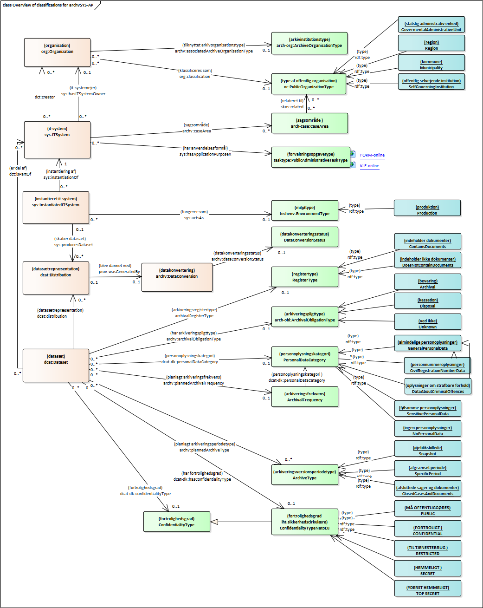

<pre class="metadata">
Title: Standard for beskrivelse af it-systemer - Arkivprofil
Status: LD
URL: http://github.com/digst/IT-System-AP/archvSYS-AP/docs/index.md
Editor: Digitaliseringsstyrelsen http://arkitektur.digst.dk
Editor: Rigsarkivet
Editor: KL
Editor: anske Regioner
Editor: Organisationen Danske Arkiver

Abstract: Dette dokument 'Standard for beskrivelse af it-systemer - Arkivprofil (archvSYS-AP)' udgør en fællesoffentlig standard for beskrivelse af offentlige myndigheders it-systemer ifm. afgivelse af it-systemoplysninger til Rigsarkivet.
Boilerplate: copyright no, conformance no, abstract yes
Shortname: archvSYS-AP
Revision: 1.0.0
Date: 2019-12-05
Max ToC Depth: 3
Markup Shorthands: markdown yes
Repository: digst/IT-System-AP/tree/master/archvSYS-AP
Inline Github Issues: full
Logo: digst...
</pre>

<h1>Standard for beskrivelse af it-systemer - Arkivprofil</h1>

Version 1.0.0

December 2019

Læsevejledning:

Dette dokument 'Standard for beskrivelse af it-systemer - Arkivprofil (archvSYS-AP)' udgør en fællesoffentlig standard for beskrivelse af offentlige myndigheders it-systemer ifm. afgivelse af it-systemoplysninger til Rigsarkivet.

Arkivprofilen anvender dele af og udvider en basisprofil 'Standard for beskrivelse af it-systemer' - Basisprofil (SYS-AP) med arkiveringsrelevante oplysninger, og specificer netop hvilke oplysninger der enten *skal* eller *kan* være til stede i forbindelse med afgivelse til Rigsarkivet.

Kapitel 1 introducerer standardens formål, baggrund og den metode, hvormed standarden er blevet udarbejdet. Kapitel 2 beskriver *anvendelse* af standarden til myndigheders afgivelse af oplysninger om it-systemer i forbindelse med arkivering.

Kapitel 3 omhandler standardens helt centrale begreber, såsom "it-system" og "databærende it-system", og Kapitel 4 præsenterer indledningsvist en oversigt over standardens  underliggende emneområder, og hver sektion i dette kapitel dykker ned i et af emneområderne.  I Kapitel 3 og 4 vil udvalgte begreber være markeret med **fed skrifttype** -- disse modelleres i den underliggende datamodel som klasser eller egenskaber og går også igen i hhv. regnearksskabelon og UML-model, som findes i bilag.

Kapitel 5 beskriver kort selve datamodellen og henviser til yderligere information. Dette kapitel fortæller også, hvordan beskrivelser af it-systemer udarbejdet i henhold til standarden kan udveksles -- dels via regneark - dels via et maskinfortolkeligt format.  

Bilagene kan inddeles i tre kategorier. Bilag A viser de klassifikationer/kontrollerede udfaldsrum, der anvendes i standarden, Bilag B-E giver eksempler på skabeloner/vejledning til udfyldelse af oplysninger om it-systemer, og Bilag F-I omhandler den bagvedliggende begrebs- og datamodel.

Introduktion
================

Dette dokument udgør en fællesoffentlig standard for beskrivelse af offentlige myndigheders it-systemer ifm. afgivelse af it-systemoplysninger til Rigsarkivet. Standarden omfatter basisoplysninger om it-systemer, som fx it-systemnavn, it-systemejer, ibrugtagningsdato mv., men udvides med arkiveringsspecifikke oplysninger. Standarden tilbyder også et forslag til en ensartet struktur for disse oplysninger i et fælles udvekslingsformat, som vil kunne gøre det muligt at dele it-systemoplysninger på en effektiv måde. 

Formål
----------

Standarden skal gøre det nemmere for myndigheder at afgive relevante oplysninger om deres it-systemer til Rigsarkivet, så de kan overholde deres arkivmæssige forpligtelser.

Baggrund
------------

Standarden er etableret på anbefaling fra Kulturministeriets Arkivudvalg og efter aftale med KL, Danske Regioner og Digitaliseringsstyrelsen. Standarden skal understøtte Rigsarkivets tilsyn med offentlige myndigheders digitale arkivdannelse, så det sikres, at it-systemer, der indeholder bevaringsværdige data, bliver identificeret og bevaret.

Metode
----------

Standarden er blevet udarbejdet på baggrund af research- og udviklingsaktiviteter kombineret med feedback fra og sparring med en projektgruppe med medlemmer fra følgende interessentorganisationer: Rigsarkivet, KL, Danske Regioner, Organisationen Danske Arkiver, OS2Kitos og Digitaliseringsstyrelsen med repræsentanter fra Ministeriernes Kontor for it-styring og Center for Teknologi og Datastrategi. I forbindelse med researchaktiviteterne er flere eksisterede modeller og værktøjsunderstøttelse til registrering af it-systemer undersøgt nærmere, fx Model for porteføljestyring af statslige it-systemer, OS2Kitos og Rigsarkivets anmeldelses- og tilsynsskemaer. Læs mere om dette i Kapitel 6 Mapning til eksisterende modeller.

Selve udviklingsarbejdet er foretaget i henhold de Fællesoffentlige regler for begrebs- og datamodellering, og standarden udgøres af en anvendelsesprofil, der sammensætter flere eksisterende modeller til denne specifikke arkiveringsanvendelse. Denne profil anvender fx kernemodeller til beskrivelse af it-system (SYS), datasæt (DCAT), organisation (ORG), juridiske ressourcer (ELI), kontakter (FIBO), klassifikationer (SKOS) m.fl. Se Dataspecifikationsdokumentet for yderligere oplysninger om disse modeller.

Standardens anvendelse
==========================

Denne arkivprofil er baseret på en basisprofil til beskrivelse af it-systemer, som rummer de helt grundlæggende oplysninger om it-systemer. Denne arkivprofil udvider basisprofilen med arkiveringsoplysninger og fastlægger, hvilke oplysninger der er krævede eller anbefalede i denne sammenhæng..

Standarden skal anvendes i forbindelse med afgivelse af systemoplysninger til Rigsarkivet. Standarden skal således standardisere afgivelsen og opdateringen af systemoplysninger i relation til regionernes og kommunernes arkivmæssige forpligtelser. Derudover vil standarden også blive anvendt ved kommende tilsyn på det statslige område. Anvendelsesprofilen indeholder netop det sæt af oplysningstyper, der er påkrævet i forbindelse med afgivelse af it-systemoplysninger til Rigsarkivet, samt yderligere anvendelsesspecifikke præciseringer.

Rigsarkivets interesse i it-systemer
----------------------------------------

Rigsarkivet vil anvende standarden i forbindelse med tilsyn med offentlige myndigheders it-systemer. Det betyder, at myndighederne ved at opmærke deres systemer med oplysningerne fra standarden vil få nemmere ved at besvare et tilsyn og kan få et overblik over, hvilke it-systemer hos dem som indeholder bevaringsværdige data. Det gør det lettere at sikre, at de arkivmæssige forpligtelser overholdes.

En udfordring for brug af standarden og for afgivelse af oplysninger er de tilfælde, hvor et it-system ikke bruges, som det er tiltænkt. Det kan både medføre, at et system, som normalt vil skulle bevares, alligevel ikke indeholder bevaringspligtige data, men også betyde, at et system, som normalt ikke skal arkiveres, vil indeholde bevaringspligtige data. Med standarden kan det registreres, hvilke typer af oplysninger der indgår i systemerne, hvorved det er muligt at identificere bevaringspligtige data.

Modenhed ift. beskrivelse af processer, services og datasæt
---------------------------------------------------------------

Et it-system yder en bestemt it-servicefor at understøtte en forretningsproces, og i den forbindelse skabes der ofte datasæt i den offentlige forvaltning.

I forbindelse med Rigsarkivets tilsyn med offentlige myndigheder er det konstateret, at det har været vanskeligt for myndighederne at vedligeholde et overblik over de systemer, som skal indberettes til Rigsarkivet i forbindelse med tilsyn.

Rigsarkivet har brug for at kunne identificere arkiveringspligtige datasæt på en pragmatisk måde, hvorfor det i de fleste tilfælde er mest hensigtsmæssig at begynde dialogen med de pågældende myndigheder på baggrund af et systemoverblik. Dette systemoverblik vil standarden danne basis for.  

Der kan være perspektiver i, at myndigheder fremover vedligeholder et overblik over datasæt, forretningsprocesser og services med en kobling til understøttende it-systemer, og således at dialogen omkring arkivering kan begynde dér. Systemoverblikket skal kunne samarbejde med de mest udbredte overblikssystemer, som myndighederne allerede har[[1]], således at de ikke skal vedligeholde flere overblik.

Centrale begreber
=====================

Begrebet 'it-system' udgør det centrale element i denne standard, men dette specialiseres og kobles til relevante klassifikationer for at indsnævre den mængde af it-systemer, der skal afgives oplysninger om ifm. arkivering

System, informationssystem og it-system
-------------------------------------------

Et ***system*** defineres generelt som "*et system er en kombination af interagerende elementer, der er organiseret for at opnå et eller flere erklærende formål"* ligesom i ISO/IEC 15288[[2]](https://euangoddard.github.io/clipboard2markdown/#_ftn2).

Det bemærkes også, at *"Et system er i denne sammenhæng menneskeskabt og består ikke blot af hardware, software og data, men også af mennesker, processer, procedurer, faciliteter og materialer og naturlige genstande".*

Ser vi alene på systemer til indsamling, organisering, lagring og kommunikation af information, har vi at gøre med informationssystemer, og når (computer)-teknologi anvendes til at behandle disse informationer eller data, har vi at gøre med it-systemer[[3]](https://euangoddard.github.io/clipboard2markdown/#_ftn3).

Begrebet ***it-system* **defineres derfor i denne standard som *"system der består af digitale informationsteknologier"***  Et it-system kan instantieres i forskellige it-miljøer. Et **instantieret it-system** kan derfor defineres som "*fysisk instans af et it-system i et bestemt it-miljø".* Det vil fx kun være relevant at arkivere data fra et it-system instantieret i et produktionsmiljø og ikke et testmiljø, men i forbindelse med afgivelse af it-systemoplysninger til Rigsarkivet bør dette fremgå klart.

I forhold til arkivering præciseres klassen ***instantieret it-system*** som værende et ***databærende it-system*** ved at sætte egenskaben 'databærende' til 'sand'.  

Begrebet databærende it-system defineres i denne standard som "instantieret it-system, der indeholder digitalt skabte data eller dokumenter".

I forbindelse med aflevering til Rigsarkivet eller kommunale stadsarkiver er der alene tale om data digitalt skabt af den offentlige forvaltning og domstolene.

Ifølge Rigsarkivets vejledninger i bevaring og kassation af arkivalier kan et databærende it-system fx være:

- et fagsystem, et register eller en database

- en elektronisk journal, som indeholder oplysninger om sager og dokumenter, men hvor selve dokumenterne findes på papir

- et elektronisk sags- og dokumenthåndteringssystem (ESDH-system), hvor både oplysninger om sager og dokumenter samt selve dokumenterne findes i digital form.

**Klassifikationer**

Denne standard anvender en række klassifikationer, som giver mulighed for at udpege en bestemt delmængde af databærende it-systemer. Klassifikationerne vil blive introduceret i det følgende kapitel[[4]](https://euangoddard.github.io/clipboard2markdown/#_ftn4)

**Hvornår er der tale om et nyt it-system?**

I forhold til ibrugtagningen af et it-system i en organisation kan det i visse tilfælde være svært at vurdere, hvornår der er tale om at organisationen overgår fra ét it-system til et andet, eksempelvis ved overgangen fra én version af et kommercielt produkt til en anden version. Her kan vurderingen eventuelt tage udgangspunkt i, om it-systemet *leverer en anden service* end den oprindelige, hvilket ofte er forbundet med etableringen af en ny kontrakt med rettighedshaveren af det kommercielle produkt. Ny kontrakt med rettighedshaveren kan altså ofte betyde nyt it-system, modsat løbende opdateringer og fejlrettelser til kørende it-systemer, men dette skal undersøges nøje for det konkrete it-system. I forhold til databærende systemer kan det også være relevant at se på, om fx hele den bagvedliggende databasestruktur er skiftet ud.

Standardens emneområder
===========================

I det følgende gives en oversigt over standardens omfang og kapabilitet

It-systemer kan beskrives ud fra flere forskellige aspekter eller emner. De grundlæggende kerneinformationer ses i midten af figuren herunder, og de øvrige otte emneområder afspejler arkitekturprincipperne fra rammearkitekturen: strategi, styring, jura, sikkerhed, opgaver, information, applikation og infrastruktur, som beskrives i Hvidbog om fællesoffentlig digital arkitektur (FDA)[[5]](https://euangoddard.github.io/clipboard2markdown/#_ftn5) .

Disse otte emner dækker bredt, og for at dække en specifik anvendelseskontekst vil det typisk være nødvendigt at udvide basisprofilen med oplysninger fra forskellige emneområder. I tillæg til de otte emneområder eksisterer et metalag med informa-tioner om myndighedens udveksling af disse oplysninger til et bestemt formål.

Figur 4.1: Illustration af standardens emneområder\
Markeringen af emnerne 'styring', 'opgaver' og 'information' og 'sikkerhed' i figuren ovenfor skal illustrere, at disse fire områder er definerende for arkivprofilens anvendelse til afgivelse af oplysninger om it-systemer til Rigsarkivet.

Afgivelse af it-systemoplysninger
-------------------------------------

Når der skal afgives oplysninger om it-systemer, som en given myndighed ***anvender***, angives ***myndighedens navn*** samt den e-mailadresse, hvormed myndigheden primært kan kontaktes (***hovedmailadresse***). Derudover angives en ***myndighedstype***, dvs. en kategorisering af offentlige organisationer ift. styringsniveau (region, kommune, statslig myndighed, offentlig selvejende institution)[[6]](https://euangoddard.github.io/clipboard2markdown/#_ftn6). Indberetningen forsynes også med en datoangivelse for, hvornår oplysningerne blev indberettet (***afgivelsesdato***). Det er den dataansvarlige myndighed, der er forpligtet til at angive it-systemoplysninger til Rigsarkivet, jf. afsnittet Styring.

Kerneinformation
--------------------

Et it-system forsynes med en ***identifikator*** (et ID), der entydigt udpeger det konkrete it-system. Et it-system tilføjes en eller flere navne. Et af navnene vil være it-systemets primære eller ***foretrukne navn,*** men andre, fx kaldenavne, kan angives som ***alternative navne.***

Hvor et it-system kan beskrives som en implementering og ibrugtagning af et softwareprodukt tilhørende en bestemt produktserie, som fx Acadre eller F2, vil it-systemnavnet typisk være lig ***navnet på produktserien***, som producenten har markedsført eller som anført i hovedkontrakten med leverandøren, men it-systemet kan også have andre lokale navne.

En produktserie kan have en overordnet ***beskrivelse af produktseriens*** egenskaber, som det fx ses i SKI-kataloget[[7]](https://euangoddard.github.io/clipboard2markdown/#_ftn7), men i forbindelse med ibrugtagning er det også muligt at angive en ***it-systembeskrivelse*** som i fritekst redegør for formålet med it-systemets anvendelse eller it-systemets nøglefunktion i en organisation. Derudover bør et it-systems ***anvendelsesformål*** også beskrives ved opmærkning ift. offentlige opgaver med klassifikationerne FORM/KLE, som det beskrives under emnet 'forretningsunderstøttelse'. Supplerende bemærkninger eller oplysninger kan også tilføjes som en ***kommentar*** i fritekst

Som en del af kerneinformationerne hører ***ibrugtagningsdato*** og ***udfasningsdato,*** som tilsammen beskriver perioden fra den dato, hvor it-systemet blev taget i brug med delvis eller fuld funktionalitet, indtil den dato, hvor it-systemet endeligt bliver afviklet. Datoangivelserne kan eventuelt suppleres med en ***operationel status,*** som angiver, hvilken tilstand systemet befinder sig i, i forhold til ibrugtagning. Se udfaldsrummet i Bilag A.

For at kunne identificere, hvilken version af softwareproduktet der er taget i anvendelse, eksempelvis i forhold til en bestemt kontrakt med en leverandør, kan det være relevant at angive et ***versionsnummer***. Hvis et versionsnummer er specificeret i kontrakten, bør dette anvendes.

*Eksempelvis kan der ved anvendelse af cBrains F2 angives version 5.3 (og ikke 5.3.0.41112)*

It-systemer kan være taget i anvendelse i forskellige miljøer iht. systemets udviklingsforløb[[8]](https://euangoddard.github.io/clipboard2markdown/#_ftn8), fx udvikling, afprøvning, præproduktion, produktion, se klassifikationen ***it-miljøtype*** i Bilag A. I forhold til arkivering er kun instanser af it-systemer i produktion relevante.

Opgaver
-----------

Et it-system yder en given it-service, som understøtter forretningens opgaver.

Et it-system kan beskrives med et eller flere anvendelsesformål, der antages at være at understøtte en ***forvaltningsopgave***. Til dette formål anvendes en klassifikation over offentlige opgaver eller såkaldte forvaltningsopgavetyper. Statslige myndigheder og regioner kan eksempelvis anvende Den Fællesoffentlige Referencemodel (FORM) -en overordnet emnesystematik, der dækker opgaveporteføljen i hele den offentlige sektor -- dvs. staten, kommunerne og regionerne. Kommuner kan anvende KL Emnesystematik (KLE) -- en emnesystematik/journalplan, der dækker det kommunale område. KLE er som regel mere detaljeret end FORM på det kommunale område. Det foreslås, at KLE anvendes af kommunerne, og FORM af regioner og statslige administrative enheder -- som minimum på det øverste niveau (hhv. serviceområde i FORM og emnegruppe i KLE):

**Klassifikation KLE:** <http://www.kle-online.dk/soegning>

**Klassifikation FORM:** <http://www.form-online.dk/soegning>

*Eksempelvis kan en myndighed anvende Formpipes Acadre og cBrains F2 ESDH til at understøtte FORM-forvaltningsopgaven "65.50.05.05 Sagshåndtering" (FORM v.2.14) el. KLE-emnet "00.15.12. Kvalitetsstyringssystem, sagsbehandling" (KLE v. Aug. 2019)*

Bemærk, at produkter i SKI-kataloget allerede er opmærket med FORM.

FORM og KLE indeholder henvisninger til de love og lovbekendtgørelser, som de offentlige opgaver udspringer fra, så ved at opmærke et it-system med FORM eksisterer der også indirekte en relation til retsgrundlaget for it-systemets anvendelse. Der er også muligt via FORM at se, hvilke myndigheder de forskellige opgaver tilhører. KLE indeholder, ud over love og lovbekendtgørelser, også bekendtgørelser. FORM mapper til paragraffer i finansloven og KLE, og KLE mapper til Social- og Indenrigsministeriets kontoplan.

Kommunale it-systemer kan tilknyttes én eller flere specifikke kommunale sagsområder i henhold til Bekendtgørelse om bevaring og kassation af digitalt skabte data og dokumenter fra kommunerne[[9]](https://euangoddard.github.io/clipboard2markdown/#_ftn9). Ligeledes kan regionale it-systemer tilknyttes én eller flere specifikke regionale sagsområder iht. Bekendtgørelse om bevaring og kassation af arkivalier i regionerne[[10]](https://euangoddard.github.io/clipboard2markdown/#_ftn10). I klassifikationen Sagsområde i Bilag A er klassifikationerne samlet med angivelse af, hvilken myndighedstype der anvender hvilke sagsområder. Det bemærkes, at klassifikationen sagsområder har et vist overlap med hhv. FORM og KLE, men anvendelsen af netop dette udfaldsrum er fastlagt ved bekendtgørelse.

Når en organisation skifter et it-system ud med et andet it-system til varetagelse af samme funktion, kan det tidligere it-system eksplicit angives som et såkaldt **forgængersystem,** se også afsnit om arkivering og datakonvertering fra sådanne forgængersystemer.

Styring
-----------

Et it-system kan have mange forskellige relationer til aktører, som hver især har en særlig interesse i systemet, og som dermed udgør systemets interessenter. Aktørerne kan være personer eller organisationer, men det anbefales, i det omfang det er muligt, ikke at registrere oplysninger om fysiske personer men derimod den relevante medarbejderrolle eller organisatoriske enhed.

På overordnet niveau angives ***it-systemejeren*** -- en person eller organisation med det overordnede ansvar for et givet it-systems drift, vedligehold og anvendelse. Ofte vil it-systemejeren være lig kontraktejeren og kan identificeres præcist i myndighedens kontraktstyring.

*Eksempelvis er Kontorchefen for Center for Systemforvaltning i Digitaliseringsstyrelsen it-systemejer for NemLog-in, mens it-systemet forvaltes af NemLog-in-teamet.*

For databærende it-systemer skal den ***dataansvarlige*** aktør også angives, dvs. den organisation, som har det administrative ansvar for data. I forhold til persondata indsnævres denne definition yderligere til "*en fysisk eller juridisk person, en offentlig myndighed, en institution eller et andet organ, der alene eller sammen med andre afgør, til hvilke formål og med hvilke hjælpemidler der må foretages behandling af personoplysninger*", jf. GDPR[[11]](https://euangoddard.github.io/clipboard2markdown/#_ftn11). Én myndighed kan være dataansvarlig for et system, mens det faktisk er ***databehandler***, som behandler personoplysninger på den dataansvarliges vegne, der er i besiddelse af systemet og anvender det. Det kan være en fordel at registrere begge oplysninger. I nogle tilfælde er der forskel på dataansvarlig og databehandler i betydningen, at de kan være forskellige organisationer. I det omfang, at leverandører har fået instruks af den dataansvarlige til at behandle personoplysninger, betragtes disse også som databehandlere, jf. Datatilsynets vejledning om databehandlere og dataansvarlige[[12]](https://euangoddard.github.io/clipboard2markdown/#_ftn12). Det kan også være relevant at angive den konkrete ***dataskaber***, dvs. den aktør, der har det primære ansvar for tilvejebringelsen af datasættet.

Et it-system kan dokumenteres ved hjælp af forskellige dokumenter, der hver har sit formål og målgruppe, fx arkitekturdokumentation, installationsvejledning og slutbrugervejledning.

Information
---------------

De data, som et instantieret it-system ***skaber,*** kan betragtes som en specifik fysisk **repræsentation** af et ***datasæt*** [[13]](https://euangoddard.github.io/clipboard2markdown/#_ftn13), og beskrivelsen af datasæt og datasætrepræsentationerfølger i denne sammenhæng W3Cs Data Catalogue Vocabulary (DCAT)[[14]](https://euangoddard.github.io/clipboard2markdown/#_ftn14). Både det (logiske) datasæt og dets (fysiske) repræsentationer kan forsynes med en ***titel.***

### Arkivering

I forhold til arkivering er det vigtigt at vide, hvornår myndigheden er begyndt at tilføje data til it-systemet, og hvornår den er ophørt med at tilføje data. Til dette formål kan it-systemets generelle ***ibrugtagningsdato*** og ***udfasningsdato*** typisk anvendes som pejlemærke, men datatilføjelsesperioden bør også fremgå eksplicit, altså ***første datatilføjelsesdato*** og ***sidste datatilføjelsesdato*** for datasættets specifikke fysiske repræsentation.Disse oplysninger er især relevante, når myndigheden har konverteret data fra andre systemer ind i systemet. Dvs. i de tilfælde, hvor ibrugtagningsdato, udfasningsdato og datering af oplysninger i systemet ikke er den samme. Fx kan første datatilføjelsesdato være den dato, hvor de tidligste data er indtastet i det eller de systemer, som data er migreret fra.

For at gøre det lettere for myndigheder at afgive oplysninger om deres it-systemer til Rigsarkivet og dermed overholde deres arkivmæssige forpligtelser[[15]](https://euangoddard.github.io/clipboard2markdown/#_ftn15) kan it-systemer og de datasætrepræsentationer, de skaber, forsynes med flere forskellige arkiveringsoplysninger ved hjælp af nærværende standard.

I forhold til arkivering af data bestemt til bevaring er det offentlige ***databærende it-systemer,*** der er i fokus, dvs. it-systemer, der indeholder data og dokumenter digitalt skabt af den offentlige forvaltning og domstolene, jf. arkivloven[[16]](https://euangoddard.github.io/clipboard2markdown/#_ftn16). Udover at det skal angives, om it-systemet er databærende, altså indeholder datasæt, kan det også præciseres, at nogle af disse data udgøres af dokumenter, ved at angive at it-systemet også er ***dokumentbærende***.

Hvorvidt den pågældende myndighed har pligt til at arkivere eller kassere data i it-systemet, kan angives med klassifikationen ***arkiveringspligttype***, se Bilag A. Digitalt skabte data og dokumenter, som ikke skal bevares i henhold til gældende lovgivning, kasseres, når opbevaringspligten efter andre bestemmelser er opfyldt, og når de efter myndighedernes egen vurdering i øvrigt ikke længere har retlig eller administrativ betydning.

I forhold til aflevering af arkiveringsversioner skal det kunne angives, om data i it-systemet planlægges afleveret som et øjebliksbillede, en afgrænset periode eller ved afsluttet arkivperiode. Her anvendes klassifikationen ***Arkiveringsversionsperiodetype***, se Bilag A,som defineres i Bekendtgørelse om arkiveringsversioner. Arkiveringsversioner af data fra et it-system afleveres enten til Rigsarkivet eller et kommunalt eller regionalt stadsarkiv, som defineres i klassifikationen ***Arkiveringsinstitutionstype***.

Det angives, om der manuelt eller automatisk er ***konverteret data og dokumenter*** fra forgængersystemet ind i det nuværende system, og om ***alle data* **eller** *udvalgte data er konverteret ind.*** Etforgængersystem er i denne forbindelse et andet it-system, der tidligere har varetaget samme funktion.

Det kan også angives, om der tidligere er udarbejdet en arkiveringsversion af data i systemet.For arkiveringsversionen angives den periode, som den dækker. Dvs. det årstal, arkiveringsversionen først dækker, til det år, som arkiveringsversionen sidst dækker.

En ***arkiveringsfrekvens*** kan også registreres, dvs. den frekvens, med hvilken en myndighed fremstiller arkiveringsversion af et givet datasæt i et it-system.

Sikkerhed
-------------

Emnet sikkerhed kan vedrøre mange forskellige aspekter, fx informationssikkerhed, persondatasikkerhed, forretnings- og samfundskritikalitet og fortrolighed.

I henhold til GDPR[[17]](https://euangoddard.github.io/clipboard2markdown/#_ftn17) og Datatilsynets 'Vejledning om fortegnelse'[[18]](https://euangoddard.github.io/clipboard2markdown/#_ftn18) er det for databærende it-systemer relevant at være opmærksom på ***datasletningsfristen***, dvs. førstkommende dato for, hvornår bestemte data i systemet skal være slettet forinden.

It-systemet kan opmærkes med en ***personoplysningskategori,*** som er beskrevet i Datadatatilsynets vejledning, og på denne måde oplyses det, hvorvidt systemet indeholder følsomme personoplysninger eller almindelige personoplysninger, herunder personnummeroplysninger og oplysninger om strafbare forhold. Dertil tilføjes en angivelse af fraværet af personoplysninger, se Bilag A. De følsomme oplysninger er udtømmende oplistet i databeskyttelsesforordningen, og alle andre oplysninger er derfor almindelige personoplysninger. Oplysninger om strafbare forhold og personnumre betragtes som almindelige personoplysninger, men databeskyttelsesloven fastsætter særlige regler om disse oplysninger. Som en hjælp til præcisering kunne en klassifikation med personoplysnings*underkategorier* eventuelt opstilles.

Data i it-systemet kan klassificeres med flere forskellige klassifikationer ift. fortrolighed, fx ***Fortrolighedsgrad iht. ISO27002***[****[19]****](https://euangoddard.github.io/clipboard2markdown/#_ftn19)eller ***Fortrolighedsgrad iht. sikkerhedscirkulæret (EU/NATO)*[**[20]**](https://euangoddard.github.io/clipboard2markdown/#_ftn20).** Se Bilag A. I forhold til klassifikation iht. sikkerhedscirkulæret kan tilføjes 'uklassificeret', så det kan angives, at der er taget stilling til fortrolighedsgraden.

*Eksempelvis kan data i beredskabssystemer eventuelt være opmærket med fortrolighedsgrad, og fortrolighed kan være et relevant aspekt ved indmelding af it-systemoplysninger såsom kritikalitetstype og systemernes tekniske tilstand. *

Fælles datamodel og udvekslingsformat
=========================================

Denne standard præsenterer et udvekslingsformat i to repræsentationer til deling af oplysninger om it-systemer.

Fælles datamodel
--------------------

Basisprofilens datamodel udgør den fælles specifikation, som anvendes og udvides i arkivprofilens datamodel.

Der gives en overordnet beskrivelse af datamodellens indhold og sammensætning i bilaget 'Om datamodellen'. Her kan også ses UML-diagrammerne for både basisprofilen og arkivprofilen. UML-modellerne er udstillet og kan tilgås via en webbrowser, hvor det er muligt at klikke sig gennem modellen. Bemærk, at modelelementernes metadata er registreret som tagged values.

- Link til webudgivelse af UML-modellerne: <https://data.gov.dk/document/itsystemspecification/v1/uml/>

Via nedenstående link findes der også en online oversigt over modellens elementer.

- Link til oversigt over modellens elementer: [https://data.gov.dk/model/profile/itsystemap.rdf](https://data.gov.dk/rdf2html/index.htm?model=https%3A%2F%2Fdata.gov.dk%2Fmodel%2Fprofile%2Fitsystemap.rdf&sheet=transform2RDFreport_da-en.xsl)

Skabelon til registrering i regneark
----------------------------------------

Der er blevet udarbejdet en skabelon til registrering af oplysninger om it-systemer i et regneark. Overskrifterne vil svare til egenskaberne, som de er præsenteret i denne standard, og hver element vil entydigt kunne mappes til den bagvedliggende datamodel. Dette betyder også, at det vil være muligt fx at konvertere data eksporteret i csv-format til et maskinfortolkeligt format.

Regnearket har den fordel, at det er let at anvende, men regneark har også den store ulempe, at det ofte kræver manuel oprettelse og videre import. Det kan også være svært at repræsentere den kompleksitet, der faktisk kan være tilstede i den bagvedliggende datamodel. Eksempelvis kan et givet it-system godt skabe flere forskellige datasæt, som hver især kan dække forskellige perioder og have forskellige dataansvarlige tilknyttet. I den aktuelle skabelon er det kun muligt at registrere ét datasæt per it-system. Et it-system kan også udstille flere forskellige datasæt, og disses id'er må registreres i samme felt, selvom dette ikke er ideelt.  

I bilaget 'Skabelon til registrering i regneark' kan ses en visning af et sådant regneark, men det kan også downloades fra:

[ https://data.gov.dk/document/itsystemspecification/v1/templates/Excelformular_til_indtastning_af_it-systemoplysninger_arkivprofil.xlsx ](https://data.gov.dk/document/itsystemspecification/v1/template/Excelformular_til_indtastning_af_it-systemoplysninger_arkivprofil.xlsx)

Maskinfortolkeligt format
-----------------------------

Hvis data skal deles på tværs, bør det være *digitalt understøttet* i de systemer, der anvendes til registrering af systemoplysninger. Systemerne bør bygge på samme logik og standard, så systemerne er i stand til at udveksle data om it-systemer på tværs af organisatoriske skel. Det kan lade sig gøre, hvis data er maskinfortolkelige. Datamodellen er derfor udtrykt med UML med en bagvedliggende semantik med Resource Description Framework (RDF), der kan fortolkes af både mennesker og maskiner. Alle elementerne i datamodellen er derfor defineret inden for rammerne af RDF og har entydig identifikation, der kan anvendes direkte som metadatabeskrivelse af data. Data udtrykt med det maskinlæsbare udvekslingsformat kan også let valideres op imod den bagvedliggende datamodel og dermed sikre højere datakvalitet i de registrerede data.

Eksempeldata i maskinlæsbart format (RDF/XML) kan ses i bilag E. Bemærk, at der også umiddelbart kan konverteres til andre serialiseringer såsom JSON-LD, Turtle, m.fl.

Godkendelsen af denne arkivprofil omfatter ikke krav om anvendelse af det maskinlæsbare RDF-format og dets serialiseringer som JSON-LD, Turtle, RDF/XML.

|

Referencer
==============

Standarder

- [ISO/IEC CD 15288 ](https://www.iso.org/standard/63711.html)"Systems Engineering--- System Life Cycle Processes"

- [ISO/IEC 16350:2015(en) ](https://www.iso.org/obp/ui/#iso:std:iso-iec:16350:ed-1:v1:en)Information technology --- Systems and software engineering --- Application management

- [ISO/IEC TR 10000-1:1998(en)](https://www.iso.org/obp/ui/#iso:std:iso-iec:tr:10000:-1:ed-4:v1:en) "Information technology --- Framework and taxonomy of International Standardized Profiles --- Part 1: General principles and documentation framework"

- ISO/IEC TR 12182:2015 "Systems and software engineering -- Framework for categorization of IT systems and software, and guide for applying it"

- ISO/IEC/IEEE 42010 "Systems and software engineering --- Architecture description "

- ISO/IEC/IEEE DIS "42020 Enterprise, systems and software --- Architecture processes"

- ISO/IEC/IEEE DIS 42030 "Systems and Software Engineering --- Architecture Evaluation"

- ISO/IEC 27002:2013 Information technology -- Security techniques -- Code of practice for information security controls: <https://www.iso.org/standard/54533.html>

- [ITIL -  The Information Technology Infrastructure Library](http://www.itlibrary.org/)

- The TOGAF® Standard, Version 9.2, <https://publications.opengroup.org/standards/togaf/specifications/c182>

- ArchiMate® 3.0.1 Specification <https://publications.opengroup.org/standards/archimate/c179>

Datamodeller / klassifikationer / retningslinjer

- Datamodellen for [OS2Kitos ](https://www.kitos.dk/)(inkl. klassifikation af applikationstyper og forretningstyper)

- OIO specifikation af it-system i [modellen for Organisation](https://arkitektur.digst.dk/sites/default/files/organisationsmodellen_version_2.0.pdf)

- KMD KOSDY-datamodel)

- Datamodellen for ServiceNow ([IT Service Management-delen](https://www.servicenow.com/products/it-service-management.html)) /ITILs (CMDB)

- Statens-IT systemkort

- Datamodellen for BMC

- Retningslinjer for dokumentation og formidling af arkitektur i digitaliseringsprojekter. (baseret på ISO)

- Fællesoffentlig Referencemodel (FORM): https://arkitektur.digst.dk/rammearkitektur/klassifikationer/form https://arkitektur.digst.dk/rammearkitektur/klassifikationer/form>

- Kommunernes Emnesystematik (KLE)

- Service- og Teknologireferencemodel (STORM): http://arkitekturguiden.digitaliser.dk/storm

- KOMBIT Rollegalleri: <https://www.kombit.dk/sites/default/files/user_upload/documents/Videnscenter/Eksempel%20fra%20KOMBIT_Rollegalleri%20implementering.pdf>

- Referencearkitektur for deling af data og dokumenter:

https://arkitektur.digst.dk/sites/default/files/20180503_rad_v1.0_-_godkendt_af_sda.pdf

Retskilder og tilhørende vejledninger:

- Bekendtgørelse nr. 183 af 26. januar 2018 om bevaring og kassation af digitalt skabte data og dokumenter <https://www.retsinformation.dk/eli/lta/2018/183>

- Bekendtgørelse nr. 266 af 23. marts 2015 om bevaring og kassation af arkivalier i regionerne\<https://www.retsinformation.dk/eli/lta/2015/266>

- Vejledning til bekendtgørelse om bevaring og kassation af digitalt skabte data og dokumenter fra kommunerne\<https://www.sa.dk/wp-content/uploads/2018/04/2007_IT_Vejledning-til-bekendtg%C3%B8relse_h%C3%B8ring-1.pdf>

- Vejledning om bevaring og kassation af arkivalier hos regionerne\<https://www.sa.dk/wp-content/uploads/2015/06/Vejledning-til-regionsbekendtg%C3%B8relsen_juni-2015.pdf>

- Bekendtgørelse nr. 1007 af 20. august 2010 om arkiveringsversioner  <https://www.retsinformation.dk/eli/lta/2010/1007>

- Vejledning om kvalitetssikring i it-systemer -- Rigsarkivets minimumskrav og anbefalinger\<https://www.sa.dk/wp-content/uploads/2016/02/Vejledning-om-kvalitetssikring.pdf>

- Arkivhåndbog for statslige myndigheder <https://www.kbharkiv.dk/images/files/Arkivering/Arkivhandbogen.pdf>

- Datatilsynets 'Vejledning om fortegnelse' <https://www.datatilsynet.dk/media/6567/fortegnelse.pdf>

- Sikkerhedscirkulæret (Cirkulære om sikkerhedsbeskyttelse af informationer af fælles interesse for landene i NATO eller EU, andre klassificerede informationer samt informationer af sikkerhedsmæssig beskyttelsesinteresse i øvrigt) <https://www.retsinformation.dk/eli/retsinfo/2014/10338>

- Databeskyttelsesloven (Lov om supplerende bestemmelser til forordning om beskyttelse af fysiske personer i forbindelse med behandling af personoplysninger og om fri udveksling af sådanne oplysninger ) <https://www.retsinformation.dk/eli/lta/2018/502>

- GDPR (generel forordning om databeskyttelse):\<https://eur-lex.europa.eu/legal-content/DA/TXT/HTML/?uri=CELEX:32016R0679&from=EN>

Bilag
=========

Bilag A: Overblik over relevante klassifikationer
-------------------------------------------------

### Klassifikation FORM:
- Distribution:[http://www.form-online.dk/](http://www.form-online.dk/soegning)
Se de overordnede emner herunder:

02	Internationale aftaler
03	Udenrigstjeneste
05	Samfundsstruktur
06	Samfundsøkonomi, samfundsdigitalisering og statistik
08	Borgerskab
10	Uddannelse og undervisning
12	Forskning
14	Arbejdsmarked
16	Kultur
17	Fritid og idræt
18	Kirke
20	Sundhed
24	Dagtilbud
26	Social service og omsorg
30	Skatter og afgifter
34	Erhverv
37	Miljø
38	Natur og klima
40	Politi
42	Retspleje og domstole
44	Straffuldbyrdelse
46	Forsvar
47	Redningsberedskab
52	Fysisk planlægning og geodata
54	Ejendomme og byggeri
56	Energi- og vandforsyning
58	Trafikinfrastruktur
59	Trafik og transport
60	Myndighedens personale og frivillige
62	Myndighedens bygninger og arealer
63	Myndighedens driftsmateriel, varer og tjenesteydelser
65	Myndighedens kommunikation og dokumentation
67	Myndighedens økonomi
68	Myndighedens it

### Klassifikation KLE:
- Distribution:[http://www.kle-online.dk/](http://www.kle-online.dk/soegning)
Se de overordnede emner herunder:

00	Kommunens styrelse
01	Fysisk planlægning og naturbeskyttelse
02	Byggeri
03	Boliger
04	Parker, fritids-/idrætsanlæg og landskabspleje mv.
05	Veje og trafik
06	Spildevand og vandløb
07	Affald og genanvendelse
08	Havne og lufthavne
09	Miljøbeskyttelse
13	Forsyning
14	Beredskab
15	Arbejdsmarked og beskæftigelsesindsats
17	Folkeskoleundervisning
18	Folkeoplysning og ungdomsskoler
19	Kulturhistoriske institutioner
20	Kulturvirksomhed
21	Biblioteker
22	Regulering af private erhverv
23	Borgerlige forhold
24	Erhvervsforhold
25	Beskatning
27	Social service
28	Dagtilbud
29	Sundhed
30	Andre myndigheders opgaver
32	Kontante ydelser
54	Uddannelse
81	Kommunens personale
82	Kommunens ejendomme og lokaler
83	Kommunens driftsmidler og inventar
84	Offentlige valg
85	Kommunens administrative systemer
86	Kommunens selvforsyning og fremstillingsvirksomhed
87	Kommunens arbejdsmiljø
88	Kommunens indkøb og udbud

###  Klassifikation Sagsområder:
Klassifikation, der består af typer af sagsområder i henhold til 'Bekendtgørelse om bevaring og kassation af digitalt skabte data og dokumenter fra kommunerne' og 'Bekendtgørelse om bevaring og kassation af arkivalier i regionerne' 
- Forretningsområde: http://www.form-online.dk/opgavenoegle/65/#65.50.05.10 
- Juridisk kilde: https://www.retsinformation.dk/eli/lta/2003/591 
- Juridisk kilde: https://www.retsinformation.dk/eli/lta/2015/266 
- Juridisk kilde: https://www.retsinformation.dk/eli/lta/2018/183 
- Kilde: https://www.sa.dk/da/offentlig-forvaltning/kommuner-og-regioner/bevaring-kassation-it-systemer 

###  Klassifikation: Offentlige organisationstyper
Klassifikation, der består af typer af offentlige organisationer set i forhold til styring og forvaltning i dansk administrativ og fællesoffentlig kontekst
- Forretningsområde: http://www.form-online.dk/opgavenoegle/05/#05.05 
- Juridisk kilde: https://www.retsinformation.dk/eli/lta/2019/47 
- Juridisk kilde: https://www.retsinformation.dk/eli/lta/2017/319  
- Juridisk kilde: https://www.retsinformation.dk/eli/lta/2006/653 
- Juridisk kilde: https://www.retsinformation.dk/eli/lta/2014/433 
- Distribution: https://data.gov.dk/concept/profile/PublicOrganisationTypes.rdf

<dl>
  <dt>kommune</dt><dd>mindste offentlige forvaltningsenhed, der styres af en kommunalbestyrelse som bekendtgjort i kommunebestyrelsesloven</dd>
  <dt>region</dt><dd>regional forvaltningsenhed, der styres af et regionsråd, og som er bekendtgjort i regionsloven</dd>
  <dt>statslig myndighed</dt><dd>statslig forvaltningsenhed, som administrerer lovgivning eller forvaltning af et bestemt område</dd>
  <dt>offentlig selvejende institution</dt><dd>selvejende institutioner, foreninger, fonde m.v., der 1) er oprettet ved lov eller i henhold til lov, og 2) er oprettet på privatretligt grundlag, og som udøver offentlig virksomhed af mere omfattende karakter og er undergivet intensiv offentlig regulering, intensivt offentligt tilsyn og intensiv offentlig kontrol</dd>	
</dl>

### Klassifikation: It-miljøtyper
Klassifikation, der består af typer af it-miljø, som et it-system kan instantieres i
Forretningsområde: http://www.form-online.dk/opgavenoegle/68/#68.55.15 
- Kilde: https://en.wikipedia.org/wiki/Deployment_environment 
- Kilde: Statens-it Systemkort
- Kilde: http://priocept.com/2018/01/30/software-environment-naming/
- Kilde: https://docs.microsoft.com/en-us/biztalk/technical-guides/planning-the-development-testing-staging-and-production-environments
- Distribution: https://data.gov.dk/concept/profile/ITEnvironmentTypes.rdf

### Klassifikation: Personoplysningskategorier
Klassifikation, der består af kategorier af personoplysninger ud fra følsomhed, idet der gælder forskellige betingelser og procedurer for behandling af oplysningerne
- Forretningsområde: http://www.form-online.dk/opgavenoegle/05/#05.05.12.60 
- Juridisk kilde: http://data.europa.eu/eli/reg/2016/679/oj 
- Juridisk kilde: https://www.retsinformation.dk/eli/lta/2018/502 
- Kilde: https://www.datatilsynet.dk/media/6567/fortegnelse.pdf 
- Kommentar: De følsomme oplysninger er udtømmende oplistet i databeskyttelsesforordningen, og alle andre oplysninger er derfor almindelige personoplysninger. Bemærk, at oplysninger om strafbare forhold og per-sonnumre betragtes som almindelige personoplysninger, men databeskyttelsesloven fastsætter særlige regler om disse oplysninger.
- Distribution: https://data.gov.dk/concept/profile/PersonalDataCategories.rdf  

### Klassifikation: Fortrolighedsgrader iht. sikkerhedscirkulæret (EU/NATO)
Klassifikation der består af grader af fortrolighed, forstået som i hvilket omfang information kan videregives iht. sikkerhedscirkulæret (EU/NATO)
- Forretningsområde: http://www.form-online.dk/opgavenoegle/68/#68.55.20 
- Kilde: https://www.retsinformation.dk/eli/retsinfo/2014/10338 
- Distribution https://data.gov.dk/concept/profile/ConfidentialityTypesNatoEU.rdf

### Klassifikation: Arkiveringspligttyper
Klassifikation, der består af typer af arkiveringspligt set i forhold til, om data skal bevares eller kasseres iht. gældende arkiveringsbestemmelser
- Forretningsområde: http://www.form-online.dk/opgavenoegle/65/#65.50.05 
- Juridisk kilde: https://www.retsinformation.dk/eli/lta/2016/1201    

### Klassifikation: Arkiveringsversionsperiodetyper
Klassifikation, der består af typer af arkiveringsperioder set i forhold til deres afgrænsning.
Kommentar: hvorvidt data i et it-system afleveres som et øjebliksbillede, en afgrænset periode eller ved af-sluttet arkivperiode 
- Forretningsområde: http://www.form-online.dk/opgavenoegle/65/#65.50.05
- Juridisk kilde: https://www.retsinformation.dk/eli/lta/2010/1007     

### Klassifikation: Arkivinstitutionstyper
Klassifikation, der består af typer af offentlige institutioner, der har til opgave at bevare arkivalier
- Forretningsområde: http://www.form-online.dk/opgavenoegle/65/#65.50.05.10 
- Juridisk kilde: https://www.retsinformation.dk/eli/lta/2016/1201 
- Kilde: https://ec.europa.eu/isa2/sites/isa/files/isa2_action_2017_01_standard_based_archival_data_manage-ment_final_report_v1.00.pdf 

### Klassifikation: Konverteringsstatusser
Klassifikation, der består af statusser ift. konvertering set ud fra omfanget af et (manuelt eller automatisk) datakonverterings- og import forløb 
- Forretningsområde: http://www.form-online.dk/opgavenoegle/65/#65.50.05
- Kilde: https://www.sa.dk/da/offentlig-forvaltning/ 

Bilag B: Skabelon til registrering i regneark (arkivprofil)
-------------------------------------------------

Vejledning til udfyldelse af skabelon i regneark: 

Regnearksskabelonen kan downloades her: 

https://data.gov.dk/document/itsystemspecification/v1/templates/Excelformular_til_indtastning_af_it-systemoplysninger_arkivprofil.xlsx

Regnearket er et forsimplet forslag til, hvordan oplysningerne kan afgives i struktureret form til Rigsarkivet med anvendelse af det fælles sprog, som standarden etablerer.
I arkiveringssammenhæng er alene instantierede it-systemer i et produktionsmiljø relevante og derud-over kun databærende it-systemer, hvor data er digitalt skabt af den offentlige forvaltning og dom-stolene. Bemærk, at denne forsimplede repræsentation alene giver mulighed for at beskrivelse et it-systems samlede dataindhold (og ikke samtlige datasætrepræsentationer)
- it-system:  system, der består af digitale informationsteknologier
- instantieret it-system:  fysisk instans af et it-system i et bestemt it-miljø
- databærende it-system: instantieret it-system, der indeholder digitalt skabte data eller dokumenter

Bilag C: Eksempel på maskinlæsbart format 
-------------------------------------------------

(Her RDF-XML og Turtle, men andre serialiseringer mulige, herunder JSON-LD) 

### EKSEMPELOUTPUT I TURTLE (Acadre anvendt i kommune X)
`
	@prefix skos: <http://www.w3.org/2004/02/skos/core#> .
	@prefix dc: <http://purl.org/dc/terms/> .
	@prefix sys: <https://data.gov.dk/model/core/itsystem#> .
	@prefix xsd: <http://www.w3.org/2001/XMLSchema#> .
	@prefix archv: <https://data.gov.dk/model/core/digitalarchival#> .
	@prefix infra: <https://data.gov.dk/model/core/infrastructure#> .
	@prefix dcat: <http://www.w3.org/ns/dcat#> .
	@prefix dcat-dk: <https://data.gov.dk/model/core/dcat-dk#> .

	<https://EXAMPLEURI1>
	  a <https://data.gov.dk/model/core/itsystem#ITSystem> ;
	  skos:prefLabel "Acadre "@da ;
	  skos:altLabel "Acadre CM"@da ;
	  dc:description "Acadre anvendes i kommune X til sagsstyring og ledelsesrapportering"@da ;
	  sys:inUseFromDate "2019-01-01"^^xsd:date ;
	  sys:hasApplicationPurposeFORM <http://www.form-online.dk/opgavenoegle/65/#65.50.05> ;
	  sys:hasApplicationPurposeKLE <http://www.kle-online.dk/emneplan/85/#_85.02.10> ;
	  archv:applicableCaseArea <https://data.gov.dk/model/classification/ArchivalCaseArea#ESDH-systemMedJournalsager> ;
	  sys:hasTargetGroup <https://data.gov.dk/model/classification/itsystemcriticalitytype#employees> ;
	  sys:hasCriticality <https://data.gov.dk/model/classification/itsystemcriticalitytype#CriticalForBusiness> ;
	  sys:hasAquisitionType <https://data.gov.dk/model/classification/itsystemaquisitiontype#Commercial-off-the-shelf> ;
	  infra:instanceOfProductInSeries "Acadre CM"^^xsd:string ;
	  archv:containsData True ;
	  archv:containsDigitalDocuments True ;
	  dc:hasPart <https://EXAMPLEURI2> .

	<https://EXAMPLEURI2>
	  a dcat:Dataset ;
	  dcat-dk:dataResponsibleOrganisation "Kommune x"@da ;
	  dcat-dk:personalDataCategory <https://data.gov.dk/model/classification/PersonalDataCategory#GeneralPersonalData> ;
	  dc:description "Journalsager fra komnune x"@da ;
	  archv:archivalObligationType <https://data.gov.dk/model/classification/ArchivalObligationType#Archival> ;
	  archv:plannedArchiveType <https://data.gov.dk/model/classification/ArchivalFrequencyType#SpecificPeriod> ;
	  archv:plannedArchivalFrequency <https://data.gov.dk/model/classification/ArchivalFrequencyType#5> ;
	  archv:previousArchiving True .

	<https://EXAMPLEURI3>
	  a sys:InstantiatedITSystem ;
	  sys:actsAs <https://data.gov.dk/model/classification/itenvironmenttype#Production> ;
	  sys:instantiationOf <https://EXAMPLEURI1> ;
	  sys:producesDataset <https://EXAMPLEURI4> ;
	  archv:latestArchiveInformationPackage [
	    a archv:ArchiveInformationPackage ;
	    dc:hasPart <https://EXAMPLEURI5>
	  ] .

	<https://EXAMPLEURI4>
	  a dcat:Distribution ;
	  dc:issued "2019-02-01"^^xsd:date ;
	  dc:modified ""^^xsd:date .

	<https://EXAMPLEURI5>
	  a dcat:Distribution ;
	  dc:issued "2002"^^xsd:date ;
	  dc:modified "2007"^^xsd:date .
`

### EKSEMPELOUTPUT I RDF/XML
-------------------------------------------------
`
	<?xml version="1.0" encoding="utf-8"?><rdf:RDF xmlns:xsd="http://www.w3.org/2001/XMLSchema#"
	  xmlns:rdf="http://www.w3.org/1999/02/22-rdf-syntax-ns#"
	  xmlns:rdfs="http://www.w3.org/2000/01/rdf-schema#"
	  xmlns:owl="http://www.w3.org/2002/07/owl#"
	  xmlns:dc11="http://purl.org/dc/elements/1.1/"
	  xmlns:voaf="http://purl.org/vocommons/voaf#"
	  xmlns:dcterms="http://purl.org/dc/terms/"
	  xmlns:dc="http://purl.org/dc/terms/" 
	  xmlns:dct="http://purl.org/dc/terms/"    
	  xmlns:dcat="http://www.w3.org/ns/dcat#" 
	  xmlns:skos="http://www.w3.org/2004/02/skos/core#"
	  xmlns:prov="http://www.w3.org/ns/prov#"
	  xmlns:adms="http://www.w3.org/ns/adms#"
	  xmlns:cv="http://data.europa.eu/m8g/"
	  xmlns:eli="http://data.europa.eu/eli/ontology#"
	  xmlns:schema="http://schema.org/"
	  xmlns:dcat-dk="https://data.gov.dk/model/core/dcat-dk#"  
	  xmlns:sys="https://data.gov.dk/model/core/itsystem#"
	  xmlns:archv="https://data.gov.dk/model/core/digitalarchival#"
	  xmlns:infra="https://data.gov.dk/model/core/infrastructure#"  > 

	<!-- IT-SYSTEM -->                    
	<rdf:Description rdf:about="https://EXAMPLEURI1">
	<rdf:type rdf:resource="https://data.gov.dk/model/core/itsystem#ITSystem"/>
	<skos:prefLabel xml:lang="da">Acadre </skos:prefLabel>
	<skos:altLabel xml:lang="da">Acadre CM</skos:altLabel>
	<dct:description xml:lang="da">Acadre anvendes i kommune X til sagsstyring og ledelsesrapporte-ring</dct:description>
	<sys:inUseFromDate rdf:datatype="http://www.w3.org/2001/XMLSchema#date">2019-01-01</sys:inUseFromDate>
	<sys:hasApplicationPurposeFORM rdf:resource="http://www.form-online.dk/opgavenoegle/65/#65.50.05"/>
	<sys:hasApplicationPurposeKLE rdf:resource="http://www.kle-online.dk/emneplan/85/#_85.02.10"/>
	<archv:applicableCaseArea rdf:resource="https://data.gov.dk/model/classification/ArchivalCaseArea#ESDH-systemMedJournalsager"/>
	<sys:hasTargetGroup rdf:resource="https://data.gov.dk/model/classification/itsystemcriticalitytype#employees"/>
	<sys:hasCriticality rdf:resource="https://data.gov.dk/model/classification/itsystemcriticalitytype#CriticalForBusiness"/>
	<sys:hasAquisitionType rdf:resource="https://data.gov.dk/model/classification/itsystemaquisitiontype#Commercial-off-the-shelf"/>
	<infra:instanceOfProductInSeries rdf:datatype="http://www.w3.org/2001/XMLSchema#string">Acadre CM</infra:instanceOfProductInSeries>
	<archv:containsData rdf:datatype="http://www.w3.org/2001/XMLSchema#boolean">True</archv:containsData>
	<archv:containsDigitalDocuments rdf:datatype="http://www.w3.org/2001/XMLSchema#boolean">True</archv:containsDigitalDocuments>
	<dct:hasPart rdf:resource="https://EXAMPLEURI2"/>
	 </rdf:Description>

	<!-- IT-SYSTEMETS DATAINDHOLD (ET LOGISK DATASÆT)-->  
	<rdf:Description rdf:about="https://EXAMPLEURI2">
	<rdf:type rdf:resource="http://www.w3.org/ns/dcat#Dataset"/>
	<dcat-dk:dataResponsibleOrganisation xml:lang="da">Kommune x</dcat-dk:dataResponsibleOrganisation>
	<dcat-dk:personalDataCategory rdf:resource="https://data.gov.dk/model/classification/PersonalDataCategory#GeneralPersonalData"/>	
	<dct:description xml:lang="da">Journalsager fra komnune x</dct:description>	
	<archv:archivalObligationType rdf:resource="https://data.gov.dk/model/classification/ArchivalObligationType#Archival"/>
	<archv:plannedArchiveType rdf:resource="https://data.gov.dk/model/classification/ArchivalFrequencyType#SpecificPeriod"/>
	<archv:plannedArchivalFrequency rdf:resource="https://data.gov.dk/model/classification/ArchivalFrequencyType#5"/>
	<archv:previousArchiving rdf:datatype="http://www.w3.org/2001/XMLSchema#boolean">True</archv:previousArchiving>
	</rdf:Description>

	<!-- IT-SYSTEMETS FYSISKE INSTANTIERING I ET IT-MILJØ --> 
	<rdf:Description rdf:about="https://EXAMPLEURI3">
	    <rdf:type rdf:resource="https://data.gov.dk/model/core/itsystem#InstantiatedITSystem"/>
	    <sys:actsAs rdf:resource="https://data.gov.dk/model/classification/itenvironmenttype#Production"/>
	    <sys:instantiationOf rdf:resource="https://EXAMPLEURI1"/>

	<!-- DET INSTANTIEREDE IT-SYSTEMS KONKRETE DATA-->	
		<sys:producesDataset>
		<rdf:Description rdf:about="https://EXAMPLEURI4">
		  <rdf:type rdf:resource="http://www.w3.org/ns/dcat#Distribution"/>
		    <dct:issued rdf:datatype="http://www.w3.org/2001/XMLSchema#date">2019-02-01</dct:issued>
		    <dct:modified rdf:datatype="http://www.w3.org/2001/XMLSchema#date"></dct:modified>
		  </rdf:Description>
			</sys:producesDataset>		
	<!-- DET INSTANTIEREDE IT-SYSTEMS SENESTE KONKRETE ARKIVERINGSVERSION-->		
		<archv:latestArchiveInformationPackage>
		<archv:ArchiveInformationPackage>
		<dct:hasPart>
		  <rdf:Description rdf:about="https://EXAMPLEURI5">
		  <rdf:type rdf:resource="http://www.w3.org/ns/dcat#Distribution"/>
		    <dct:issued rdf:datatype="http://www.w3.org/2001/XMLSchema#date">2002</dct:issued>
		    <dct:modified rdf:datatype="http://www.w3.org/2001/XMLSchema#date">2007</dct:modified>
		  </rdf:Description>
		</dct:hasPart>
		</archv:ArchiveInformationPackage>
		</archv:latestArchiveInformationPackage>
	</rdf:Description>
	</rdf:RDF>
`

Bilag D: Om datamodellen
-------------------------------------------------
Selve UML-modellerne er udstillet her : 
https://data.gov.dk/document/itsystemspecification/v1/uml/

Bilag E: UML-diagram: Arkivprofil
-------------------------------------------------
- Namespace: https://data.gov.dk/model/profile/itsystemap-archv# 
- Modelnavn (label): Indmeldelse af it-systemoplysninger til Rigsarkivet
- Modelansvarlig (responsibleEntity): Rigsarkivet (projektgruppen)
- Versionnummer (versionInfo): 1.0.0
- Seneste opdateringsdato (dateModified): 11-11-2019
- Modelstatus (modelStatus): Development
- Godkendelsesstatus (approvalStatus): Afventer godkendelse
- Modelomfang (modelScope): Anvendelsesmodel
- Forretningsområde (theme):  65.50.05.10 Sagsarkivering  
- Kommentar (comment): Anvendelsesprofil for det sæt af oplysningstyper, der er påkrævet eller anbefalet ifm. afgivelse af it-systemoplysninger til Rigsarkivet 

Bilag F: Begrebsliste til Arkivprofilen (archvSYS-AP)
-------------------------------------------------
- Namespace: https://data.gov.dk/concept/profile/itsystemap-archv/ 
- Modelnavn (label): Begrebsliste til arkivprofilen
- Modelansvarlig (responsibleEntity): Rigsarkivet (projektgruppen)
- Versionnummer (versionInfo): 1.0.0
- Seneste opdateringsdato (dateModified): 11-11-2019
- Modelstatus (modelStatus): development
- Godkendelsesstatus (approvalStatus): afventer godkendelse
- Forretningsområde (theme):  65.50.05.10 Sagsarkivering  
- Afledt af (wasDerivedFrom): https://data.gov.dk/model/concept/digitalarchival/ 
- Afledt af (wasDerivedFrom): https://data.gov.dk/model/concept/itsystem/
- Kommentar (comment): Samlet begrebsliste med begreber, der er relevante ifm. afgivelse af oplysninger om it-systemer til Rigsarkivet. Bemærk, at denne anvendelsesorienterede begrebsliste udvælger og sammensætter begreber fra forskellige emneområder, se fx begrebsmodellen for it-system og begrebsmodellen for digital arkivering, som er udstillet online. 

Dette dokument 'Standard for beskrivelse af it-systemer - Arkivprofil (archvSYS-AP)' udgør en fællesoffentlig standard for beskrivelse af offentlige myndigheders it-systemer ifm. afgivelse af it-systemoplysninger til Rigsarkivet.

arkitektur.digst.dk

* * * * *
[1] Som eksempel kan nævnes KITOS, som mange kommuner anvender som systemoverblik.

[[1]](https://euangoddard.github.io/clipboard2markdown/#_ftnref1) Som eksempel kan nævnes KITOS, som mange kommuner anvender som systemoverblik.

[[2]](https://euangoddard.github.io/clipboard2markdown/#_ftnref2)  ISO/IEC 15288 (Systems and software engineering -- System life cycle processes)  

[[3]](https://euangoddard.github.io/clipboard2markdown/#_ftnref3) Begrebet 'it-system' er altså en specialisering af 'system' fra ISO 15288, idet der fokuseres på IT-aspektet.Det vurderes derudover at definitionen er tråd med ISO/IEC TR 10000-1:1998(en)

Information technology --- Framework and taxonomy of International Standardized Profiles og ISO/IEC TR 12182:2015 (Systems and software engineering -- -- Framework for categorization of IT systems and software, and guide for applying it .

[[4]](https://euangoddard.github.io/clipboard2markdown/#_ftnref4) Klassifikationer beskrives iht. anvendelsesprofil for klassifikation: <https://arkitektur.digst.dk/rammearkitektur/datastandarder/anvendelsesprofil-klassifikationer>

[[5]](https://euangoddard.github.io/clipboard2markdown/#_ftnref5) <https://arkitektur.digst.dk/mandat-og-styring/hvidbog-om-faellesoffentlig-digital-arkitektur>

[[6]](https://euangoddard.github.io/clipboard2markdown/#_ftnref6) Myndigheder skal beskrives som organisationer iht. anvendelsesprofil for organisationer: <https://arkitektur.digst.dk/rammearkitektur/datastandarder/anvendelsesprofil-organisationer> 

[[7]](https://euangoddard.github.io/clipboard2markdown/#_ftnref7) https://skikataloget.ski.dk/ski-kataloget/

[[8]](https://euangoddard.github.io/clipboard2markdown/#_ftnref8) https://dltj.org/article/software-development-practice/

[[9]](https://euangoddard.github.io/clipboard2markdown/#_ftnref9) https://www.retsinformation.dk/eli/lta/2018/183

[[10]](https://euangoddard.github.io/clipboard2markdown/#_ftnref10) https://www.retsinformation.dk/eli/lta/2015/266

[[11]](https://euangoddard.github.io/clipboard2markdown/#_ftnref11) <http://data.europa.eu/eli/reg/2016/679/oj>:\
 <https://www.retsinformation.dk/eli/lta/2018/502>

[[12]](https://euangoddard.github.io/clipboard2markdown/#_ftnref12) <https://www.datatilsynet.dk/media/6560/dataansvarlige-og-databehandlere.pdf>

[[13]](https://euangoddard.github.io/clipboard2markdown/#_ftnref13) 'Referencearkitektur for deling af data og dokumenter' definerer datasæt som "en samling af oplysninger bestående af enkelte dele der forvaltes under et " <https://arkitektur.digst.dk/sites/default/files/20180503_rad_v1.0_-_godkendt_af_sda.pdf>. Denne definition er i tråd med W3Cs definition " samling af data, udstillet eller forvaltet af en enkelt aktør".

[[14]](https://euangoddard.github.io/clipboard2markdown/#_ftnref14) https://www.w3.org/TR/vocab-dcat/\
 (Bemærk at DCAT anvender et snævrere datasætbegreb end det der defineres i ISO 19115‑1:2014)

[[15]](https://euangoddard.github.io/clipboard2markdown/#_ftnref15) Læs mere på Rigsakivets hjemmeside: <https://www.sa.dk/da/offentlig-forvaltning/>

[[16]](https://euangoddard.github.io/clipboard2markdown/#_ftnref16) <https://www.retsinformation.dk/eli/lta/2016/1201>

[[17]](https://euangoddard.github.io/clipboard2markdown/#_ftnref17) http://data.europa.eu/eli/reg/2016/679/oj\
 https://www.retsinformation.dk/eli/lta/2018/502

[[18]](https://euangoddard.github.io/clipboard2markdown/#_ftnref18) https://www.datatilsynet.dk/media/6567/fortegnelse.pdf

[[19]](https://euangoddard.github.io/clipboard2markdown/#_ftnref19) ISO/IEC 27002:2013 Information technology -- Security techniques -- Code of practice for information security controls: https://www.iso.org/standard/54533.html

[[20]](https://euangoddard.github.io/clipboard2markdown/#_ftnref20) Sikkerhedscirkulæret https://www.retsinformation.dk/eli/retsinfo/2014/10338
